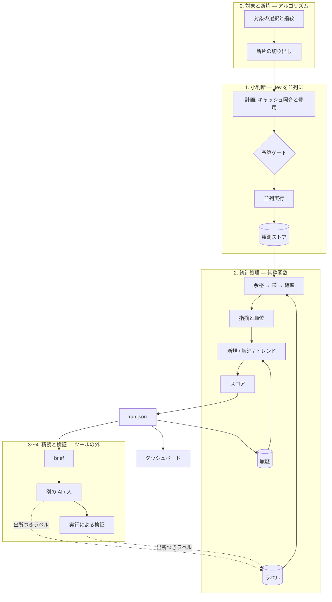

# jev-checkup (仮称) — 設計

> 状態: 設計の第 3 版。コードはまだ無い。
> 日付: 2026-09-20
> [IDEA.md](IDEA.md) が「なぜ・何を」、この文書が「どう作るか」。IDEA.md の内容は繰り返さず参照する。
> IDEA.md の決定を引いている箇所を除き、この文書はすべて **提案 (未合意)**。
> 方針: 目的とコンセプトから逆算し、**要るものだけ**で組む。要らないと判断したものは 13 章に理由つきで並べた。

## 1. 設計が満たすべきもの

**命題**: 静的に検査できない健康性を、検査可能にする。
**プロダクト**: コードベースの健康性ダッシュボード — 総合スコア / 観点別スコア / トレンド / 指摘を一体として健康状態を表す (決定 D)。

IDEA.md は「検査可能である」を 3 つの条件で定義した。設計の各部は、このどれかを成り立たせるためにある。

| 満たすべきもの | それを成り立たせる仕組み | 章 |
| --- | --- | --- |
| **観測できる** | 対象 → 断片 → 原子的な質問 → Jev の並列な小判断 | 5 |
| **どこまで信用できるかがわかる** | 生の値の保存、ラベルと観測の結合による較正、「測れていないもの」の表示 | 5.6、6.2、6.7、7 |
| **時間を追って比べられる** | 指紋、測定条件の版、実行の履歴 | 5.1、6.5、6.6 |
| 設計原則: 読む価値のある問題を届ける | 順位、brief、上位 N 件の有用率の自己測定 | 6.3、8.2 |
| 決定 A: Jev は並列のセンサー | 漏斗 | 4 |

## 2. 設計の要点

全体を形づくる判断は 5 つ。

1. **Jev は漏斗の 1 段にだけいる。** 何を・どの文脈で訊くかはアルゴリズムが決め、答えをどう読むかは統計が決める。
   Jev に総合判断・説明・数えることをさせない。
2. **観測は高くて不変、導出は無料で純粋。** 生の判定値を全部残し、閾値・較正・スコア・ダッシュボードは毎回そこから計算し直す。
   導出より後ろはネットワークも API キーも要らず、テストは観測のフィクスチャだけで書ける。
3. **ハッシュは 2 つ、仕事が違う。** キャッシュキーはコードを含み、「訊き直しが要るか」を決める。
   測定条件の版はコードを含まず、「前回と比べてよいか」を決める。
4. **ラベルは判定値についてではなく、コードについての言明。** だから質問やモデルを変えてもラベルは生き残り、
   較正は毎回ラベルと現在の観測を結合して作り直せる。較正を変えても訊き直さず、基準線もリセットしない。
5. **`run.json` が唯一の接点。** ダッシュボード、brief、履歴、GitHub への投稿は、これだけを読む。

## 3. 全体構成



## 4. 漏斗 — 安く広く → 高く狭く

監査で実際に成果を出した流れ (Jev で当たりをつける → 人とエージェントが精読する → ミューテーションで確かめる) を、そのまま構造にする。
段が進むほど 1 件あたりは高くつき、件数は絞られる。各段の仕事は、次の段が読む価値のあるものを選ぶこと。

| 段 | 担い手 | 1 件あたり | 件数の規模 | 出すもの |
| --- | --- | --- | --- | --- |
| 0. 対象と断片 | アルゴリズム (AST) | ほぼ 0 | 全部 (万) | 対象、指紋、判断に要る最小の断片 |
| 1. 小判断 | **Jev を並列に** | 〜$0.0001 | 全部 | 確率の行列 (対象 × 質問) |
| 2. 統計処理 | コード | 0 | 全部 | 較正済みの確率、順位、スコア、トレンド |
| 3. 精読 | 別の AI / 人 | 数セント〜数分 | 上位の数十件 | 仮説、検証の手順、ラベル |
| 4. 実行による検証 | ミューテーションなど | 秒〜分 | 数件 | 事実、ラベル |

**このツールが実装するのは段 0〜2 と、段 3 への受け渡し (brief)。** ダッシュボードは段 2 の出力から作る。
段 3・4 はツールの外にあり、結果はラベルとして戻ってきて、ダッシュボードの信用 (較正) を上げる。

## 5. 観測

### 5.1 対象と指紋

対象は ast-grep のパターンで選ぶ (広めに拾い、判断は後段に任せる — IDEA.md)。選んだ時点で指紋を付ける。

```text
fingerprint = hash( 観点 ID + ファイルパス + 対象の安定した識別情報 )
contentHash = hash( 断片の中身 )
```

| 観点 | 識別情報 |
| --- | --- |
| テスト | `describe` の連鎖 + テスト名 (同名が並ぶ場合は出現順) |
| 名前 | 種別 + 修飾名 (`function:formatBytes`、`Class.method`) |

- 行番号は使わない (上に 1 行足すだけで全件が「新規」になる)。
- リネームやファイル移動は「解消 + 新規」に見える。許容し、ダッシュボードに明記する。

### 5.2 断片

断片は、その観点の質問に答えるのに要る最小のコード。**観点ごとに切り出し方を 1 つ**持つ。

| 観点 | 断片 | 理由 |
| --- | --- | --- |
| テスト | **兄弟テストを除いたファイル** (import、モック、fixture、ヘルパー、外側のフック + 対象のテスト) | 下記 |
| 名前 (関数) | 宣言の全体 (doc コメント、シグネチャ、本体) | 名前と中身の一致は宣言の中で裁ける |
| 名前 (変数) | その変数を含む関数 | 初期化と使われ方が見える |
| 名前 (モジュール) | ファイルのトップレベル宣言の一覧 (本体は省く) | ファイル名と export の一致を見る |

テストの断片には、相反する 2 つの事実がある。監査の誤検知 63% の主因は「テスト本体しか見せなかったこと」だった。
一方で公式ドキュメントは「判断に無関係な内容が増えると精度が落ちる」「質問に関係する文脈だけを含めよ」としている。
テストファイルのかさの大半は他のテストなので、兄弟を消すだけで断片は小さくなり、ファイル内の前提は全部残る。
ast-grep で兄弟の `it` / `test` を落とすだけで実装できる。

- **断片に対象は 1 つ。** IDEA.md の「バッチ内で対象を取り違える」問題は、構造上起きなくなる。
- 断片が上限 (`state` 32k トークン) を超えたら**判定不能**として数える。黙って切り詰めない。
- 切り出し方には版があり、測定条件 (6.5) に入る。
- どの切り出し方が最良かはスパイクの最初の項目で確かめる (本体のみ / 兄弟除き / ファイル全体)。

### 5.3 質問

- 英語、1 質問 1 条件、肯定形、**yes = 問題の兆候**。Jev は否定・二重否定・間接的な指示に弱く、P(q) と 1−P(¬q) は比較できない。
  IDEA.md の例の `assertion_checks_behavior: false` は「アサーションは存在・型・長さだけを見ている」のように書き直す。
- 数えさせない。計算させない。質問文に閾値や数字を書かない。Jev は数値に弱い。
- **1 リクエスト = 1 断片 + その観点の原子的な質問すべて。** `state` は 1 回しか課金されず、質問どうしは独立に並列で評価される。
- 質問ごとに閾値 θ を持つ (初期値はスパイクで決める)。
- 質問文と criteria は自分たちの言葉で書く (clean-room)。文言を変えたら測定条件が変わる。

### 5.4 計画と予算

- **計画は純粋関数**: (対象、質問、観測ストア) → キャッシュに無いリクエストの一覧と見積もりトークン。
  観測は 1 段なので、リクエスト数は送信前に確定する。`--dry-run` は計画を表示して終了し、通常実行も同じ計画を通る。
- トークナイザは公開されていない前提で、見積もりは文字数からの近似。実行のたびに `usage.input_tokens` との比を記録して係数を補正する。
- **防御は二重。** (1) 見積もりが上限を超えたら 1 件も送らない。(2) 実行中も実測の累計が上限に達したら止める。
- **上限は未設定でも既定値を持つ** (提案: $1)。大きなリポジトリでの初回の事故は、設定していない人に起こる。
- 予算で止まった実行は `complete: false` になり、届かなかった対象は「未評価」として数える。

### 5.5 並列実行

小さい断片では 1 対象 = 1 リクエストになり、**律速は費用ではなくリクエスト数** (公称 1,200 req/分 = 20 req/秒)。

| 対象 | リクエスト数 | 所要 (初回、公称値で) |
| --- | ---: | ---: |
| HardwareVisualizer `src/` | 〜8,700 | 〜7 分 |
| リポジトリ全体 | 〜22,800 | 〜19 分 |
| 直近 2 コミットの差分 | 〜140 | 数秒 |

2 回目以降はキャッシュで差分だけになる。費用は数十セント〜数ドルの規模 (概算。正確な数字は `--dry-run` が出す)。

- 仕組みは 2 つだけ: **同時接続数の上限**と **req/分 のリミッタ**。tok/秒 の制限 (250k) は、この断片の大きさでは先に当たらない。
- 429 / 529 のリトライは SDK に任せ、繰り返し出たら発行レートを下げる。制限は動的なので、既定は公称値より控えめにする。
- **結果は届いた順に観測ストアへ追記する。** 途中で止まっても、次の実行はキャッシュに無い分だけを送る。再開のための仕組みは別に要らない。

### 5.6 観測ストア

- キーは**小判断単位**: `hash( 実モデル版 + 断片の中身 + 切り出し方の版 + 質問文 + criteria )`。
  テスト 1 件を編集しても無効になるのはそのテストの断片だけ (共有のセットアップを変えれば、それを含む断片すべて)。
- 値: 生の判定値、実モデル版、usage、時刻。**ソースコードは保存しない** (ハッシュのみ)。ストアを共有しても中身は漏れない。
- 形式はキーごとの小さな JSON。ネイティブ依存 (SQLite 等) は持ち込まない。場所は `--state-dir` (既定 `.jev-checkup/`)。
- **モデル版は固定が既定。** エイリアス (`jev-latest`) は予告なく動き、公式も固定を勧めている。
  新しい版が出たら「切り替えると基準線がリセットされる」と知らせるだけで、勝手に移らない。

## 6. 統計処理

### 6.1 余裕 → 帯 → 確率

```text
余裕ᵢ  = 生の値ᵢ − θᵢ            (原子的な質問ごと)
signal = max( 余裕ᵢ )
指摘    ⇔ signal ≥ 0
帯      = signal の区間          (< +0.05 / +0.05〜0.15 / +0.15〜0.30 / ≥ +0.30)
```

- **合成は最大値。** 質問は「yes = 問題」に揃えてあるので、どれか 1 つが立てばそれが理由になる。
  公式のカスケード例も同じ形で、平均すると高確信の 1 問が埋もれるとしている。
- **立った質問が、そのまま機械可読な理由。** モデルに説明文を書かせない (IDEA.md)。
- 帯は監査データと同じ切り方 (閾値からの余裕)。手元の実測がそのまま使える。

### 6.2 較正 = ラベル ⋈ 観測

ラベルはコードについての言明 (7 章) なので、較正表は保存せず、**毎回ラベルと現在の観測を (指紋, 内容ハッシュ) で結合して作る**。

```text
P(valid | 帯) = ( 帯内の valid + 事前の valid ) / ( 帯内のラベル数 + 事前の件数 )
P(high  | 帯) = 同じ形で、valid のうち high の割合
```

- 事前値は**同梱コーパス**から来る。コーパス (`corpus/`) は断片そのものを持つので、質問やモデルを変えても訊き直して表を作り直せる。
  リリースごとに、同梱の観点定義と固定したモデル版での表を同梱する。
- 利用者のラベルが増えるほど、利用者のリポジトリの実績が表を支配する。
- コードが変わったラベル (内容ハッシュが合わない) は結合から落ちる。
- **較正状態を必ず表示する**: `local` (このリポジトリのラベル N 件) / `corpus` (同梱コーパスの事前値のみ) / `none`
  (モデル版が同梱の表と違う、など)。`none` の観点は表示するが総合点に入れない (IDEA.md)。
- コーパスの開発では、IDEA.md のとおりファイル単位で開発用 / 評価用を分け、評価用には出所が `human` / `execution` のラベルだけを使う。

### 6.3 順位

```text
順位 = P(valid | 帯) × P(high | 帯) の降順、同点は signal の降順
```

- 較正と同じ表の 2 列で決まる。監査データでは high (直すべき 13 件) のうち 11 件が最上位の帯にあり、これで十分に分かれる。
- 対応状況が `accept` / `defer` / `dismiss` のラベルが付いた指摘は上位 N 件から外し、件数には数えて別枠で見せる。
- **上位 N 件の有用率を自分で測る。** 前回の上位 N 件に付いたラベルから
  「読む価値があったと記録されたのは N 件中 k 件 (未ラベル m 件)」をダッシュボードに出す。設計原則 (Precision@N) の自己点検になる。

### 6.4 スコア

- 観点スコア = `1 − Σ P(valid | 帯) / 評価した対象数`。指摘を同じ重みで数えず、期待値にする (IDEA.md)。
- 総合点 = `none` でない観点のスコアの加重平均。重みは設定に置き、必ず表示する。既定は等重み。
- スコアは単体で見せない。IDEA.md の一覧 (未解決数、評価数、判定不能数、含まれた観点の数、較正状態、測定条件、トレンド) を必ず添える。
- 100 点を目指すゲートではなく、悪化と異常を見つけるための数値 (IDEA.md)。終了コードには使わない。

### 6.5 測定条件の版 — 比べてよいかを決める

```text
測定条件の版 = hash( 実モデル版 + 対象の選択パターン + 切り出し方の版 + 質問文と criteria + 閾値 θ )   ※観点ごと
```

- コードは含めない。コードの変化こそ測りたいものだから。
- **較正 (ラベル) も含めない。** 「新規 / 解消」は signal ≥ 0 だけで決まり、較正に依らない。
  スコアの線は、過去の実行の帯ごとの件数 (`run.json` に残す) を**現在の較正表で引き直して**描く。
  ラベルを足すたびに基準線がリセットされることはない。
- 版が変わった観点だけ、前回比を出さず「基準線をリセットした」と表示する。テストの質問を直しても、名前の観点の線は続く。

### 6.6 新規 / 解消とトレンド

- 履歴 = 過去の `run.json` を積んだディレクトリ。核は `--history <dir>` を読むだけで、それがどこに保存されているかは知らない。
- 比較の相手は、**同じ測定条件の版を持つ直近の完了した実行**。指紋で突き合わせて 新規 / 継続 / 解消 に分ける。
- **解消と言ってよいのは 2 つの場合だけ**: 今回も評価して signal < 0 になった (`value_dropped`) か、対象がコードから消えた (`target_gone`)。
  前者は修正、後者は修正とは限らないので区別する。未評価の対象を解消に数えない。
- トレンドの主役は率ではなく**新規 / 解消の件数** (率は分母の水増しで動く — IDEA.md)。直近の比較可能な実行を表で並べる。
- スコアの差は、スパイクで測ったノイズの床を超えたときだけ出す。

### 6.7 測れていないもの

「測れていないものを正常と扱わない」(IDEA.md) を、ダッシュボードの 1 区画として常に出す。

- 判定不能 (断片が上限を超えた) と未評価 (予算・エラー) の件数
- 較正状態が `corpus` / `none` の観点
- 対象外だったファイル (未対応の言語、exclude)
- 見落とし率: 無作為サンプルのラベルが無いうちは「未測定」と書く
- 測定の限界: 日本語のテスト名・コメントでは精度が落ちうる / コード内の記述で判定を誘導されうる

## 7. ラベル

```jsonc
// .jev-checkup/labels.jsonl — 1 行 1 件
{ "fingerprint": "7be1…", "contentHash": "91c0…",
  "validity": "valid", "priority": "high", "resolution": "fix",
  "source": "human", "note": "省略を一度もアサートしていない" }
```

- 3 つの軸は IDEA.md のとおり: 正誤 → 較正 / 優先度 → 順位 / 対応状況 → ダッシュボードの表示。
- **リポジトリ内のファイルとして持つ。** PR でレビューでき、インフラ不要、オフラインで動く。
- **ラベルはコードについての言明で、判定値を含まない** (要点 4)。質問・閾値・モデルを変えても、コードが同じならそのまま使える。
- **出所を持つ**: `human` / `agent` / `execution` (ミューテーションなど実行で確かめた)。
  `agent` のラベルで較正を**評価**すると、その AI の偏りを正解として測ることになる。評価に使うのは `human` と `execution` だけ。
- 別の AI が書いた説明 (叙述) の居場所は `note` だけ。`run.json` とスコアには入らない。
- **コード内の抑制コメントは採用しない。** 「正しいが直さない」を invalid と誤学習する (IDEA.md) うえ、
  コメントは断片に入ってモデルを誘導し、キャッシュも無効にする。
- 最初の版に入力用の道具は作らない (決定 C)。手で書くか、brief を読んだ人や AI が書く。brief が記入用の行を含む (8.2)。
- スパイクで作るラベルを最初からこの形式で書く。それがそのまま同梱コーパスの種になる。

## 8. 提示

### 8.1 ダッシュボード

端末、Markdown、Job Summary、ピン留め issue に**同じ内容を同じ順**で出す (決定 D の図のとおり)。

1. **総合スコア** — 含まれた観点の数、重み、前回比 (比べられる場合のみ)
2. **観点別スコア** — 観点ごとに 1 行: スコア、未解決 / 新規 / 解消、評価数、較正状態、測定条件の版
3. **トレンド** — 直近の比較可能な実行の表。条件が変わった所で線を切り、基準線のリセットとして示す
4. **指摘** — 上位 N 件。位置、立った質問、帯、P(valid)、対応状況。続いて `accept` / `defer` の別枠
5. **測れていないもの** (6.7) と、前回の上位 N 件の有用率 (6.3)

端末での姿 (例。数値は架空):

```text
Codebase Health  0.974   2 観点 / 等重み   前回比 +0.003

観点              スコア  未解決  新規  解消   評価数  較正          条件
test-honesty      0.981      31     2     3    1,204  local (86)    c9f2
naming-honesty    0.967      58     5     1    7,514  corpus        a41b
unused                —      12     —     —        —  none          —      総合点に含めない

トレンド  test-honesty / 条件 c9f2
  09-06   未解決 33   新規 1   解消 0
  09-13   未解決 32   新規 0   解消 1
  09-20   未解決 31   新規 2   解消 3

読むべき指摘  上位 3 / 31
  1  src/x.test.ts  "omits linkLocalIpv6 section when array is empty"
     立った質問: asserts_only_shape 0.91   帯 ≥+0.30   P(valid) 0.80
  ...

測れていないもの
  判定不能 3 / 未評価 0 / 対象外 12 ファイル / 見落とし率: 未測定
  前回の上位 10 件: 読む価値あり 6 / なし 2 / 未ラベル 2
```

根拠は 3 つに分類して混ぜない。

| 分類 | 出所 | 扱い |
| --- | --- | --- |
| 事実 | 静的解析、実行 | そのまま報告する |
| 推定 | Jev の判定値 + 較正 | 確率と、立った質問を見せる |
| 叙述 | 別の AI が書いた説明 | 仮説。ラベルの `note` にだけ置き、ダッシュボードの数値には入れない |

### 8.2 brief — 別の AI・人への受け渡し

`jev-checkup brief run.json --top N` が、上位の指摘ごとに次をまとめた Markdown を書き出す。

- 位置と断片 (コードはデータとして区切って載せる)
- 立った質問と生の値、帯、P(valid)
- **確認できていないこと** (例: 「セットアップが主張の状況を作っているかは、断片の外の fixture による」)
- 検証の提案 (例: 「この条件を反転して、このテストが赤くなるか」)
- **記入用のラベル行** (指紋と内容ハッシュを埋めた 1 行。読んだ人や AI が値を入れて `labels.jsonl` に足す)

**ツール自身は LLM を呼ばない。** 第 2 のベンダーへの依存・API キー・非決定性を核に持ち込まないためで、
コードの第 2 の送信先を決めるのはツールではなく利用者になる。読み手は Claude Code でも、他のエージェントでも、人でもよい。

### 8.3 GitHub

- `report --format github` が `GITHUB_STEP_SUMMARY` に書き、ピン留め issue を upsert する (本文の隠しマーカーで同定)。
  issue 本文の上限 (65,536 文字) があるので上位 N 件に絞る。ピン留めは 3 件までなので、失敗しても issue の更新は続ける。
- Action は CLI を呼ぶだけの composite action。
- **履歴は専用ブランチに積む** (IDEA.md)。`actions/cache` は 7 日間アクセスが無いと消えるので、週次スキャンの履歴には向かない。
  観測ストアは `actions/cache` でよい (消えても再構築できる)。ブランチの出し入れは Action の仕事で、CLI は `--history <dir>` しか知らない。

## 9. 事実源の観点 (knip / jscpd)

決定 C の 4 観点のうち、未使用と重複は事実源から来る。Jev の観点と同じ形に載せる。

| | 未使用 (knip) | 重複 (jscpd) |
| --- | --- | --- |
| 実行 | 利用者のプロジェクトに入っているものを利用者の設定で。無ければ「未測定」 | 同梱の依存として実行 |
| 指紋の識別情報 | 報告種別 + シンボル名 | 重複断片の正規化した中身のハッシュ |
| 帯 | 報告種別 (files / exports / dependencies) | 断片の大きさ |
| 報告の名前 | 「参照グラフ上で未使用」 | 「重複候補」 |
| 測定条件 | ツールの版 + 設定のハッシュ | 同左 |

- ラベルが無いうちは較正状態が `none` なので、**表示されるが総合点には入らない**。
- 未解決: 分母。knip は export の総数を返さない。提案は、対象の選択で export を数えること。重複は jscpd の重複行率を使う。
- **作る順番は最後にする。** このツールの独自の価値は Jev の観点の側にあり (IDEA.md の未決事項)、
  削るならここから削る。先に作る 2 観点だけでもダッシュボードは成立する。

## 10. CLI、設定、`run.json`

```text
jev-checkup scan [paths...]      観測 → 導出 → run.json を書き、端末にダッシュボードを出す
    --dry-run                    計画と概算費用を表示して終了 (何も送らない)
    --max-cost <usd>             予算の上限 (未指定でも既定値あり)
    --history <dir>              過去の run.json (新規 / 解消とトレンドの比較元)
    --state-dir <dir>            観測ストアの場所 (既定 .jev-checkup/)
    --out <path>                 run.json の書き出し先

jev-checkup report <run.json>    ダッシュボードを描画し直す / 投稿する (何も送らない)
    --history <dir>  --format <terminal|markdown|github>

jev-checkup brief <run.json>     上位 N 件を、別の AI や人に渡す形にする (何も送らない)
    --top <n>
```

- **指摘ではビルドを落とさないが、ツールが仕事をできなかったときは非 0 で終わる**
  (設定の誤り、認証の失敗、予算超過で何も送らなかった)。定期ジョブが緑のまま何もしていない状態を避ける。
- 閾値や較正を変えた後の再計算に専用のコマンドは要らない。`scan` をもう一度回せば、全部キャッシュに当たって無料で導出し直される。
- 設定は宣言的なファイル (YAML) + JSON Schema。測定条件の版を安定してハッシュでき、読み込みでコードを実行しない。
  中身は include / exclude、モデル版、予算、観点の有効・無効、重み、閾値の上書き。API キーは `TYPESAFE_API_KEY` からのみ読む。
- 同梱の観点定義 (選択パターン、切り出し方、質問文、θ、固定の説明文) は同じ宣言的な形式のデータとして持つ。

```jsonc
{
  "schema": 1,
  "tool": "0.1.0",
  "run": { "at": "2026-09-20T03:00:00Z", "commit": "abc1234", "complete": true },
  "aspects": [{
    "id": "test-honesty",
    "condition": "c9f2…",                                    // 測定条件の版
    "calibration": { "source": "local", "labels": 86 },      // local | corpus | none
    "evaluated": 1204, "unjudgeable": 3, "unevaluated": 0,
    "open": 31, "new": 2, "resolved": 3,
    "bands": { ">=+0.30": 6, "+0.15..0.30": 9, "+0.05..0.15": 8, "<+0.05": 8 },   // スコアの線を引き直すため
    "score": 0.981, "inTotal": true
  }],
  "total": { "score": 0.974, "aspects": 2, "weights": { "test-honesty": 1, "naming-honesty": 1 } },
  "findings": [{
    "fingerprint": "7be1…", "contentHash": "91c0…",
    "aspect": "test-honesty", "status": "new", "rank": 1,    // new | persisting
    "location": { "file": "src/x.test.ts", "startLine": 120, "endLine": 141 },
    "target": { "path": ["formatNetwork"], "name": "omits linkLocalIpv6 section when array is empty" },
    "evidence": {
      "slice": "file-minus-siblings@1",
      "questions": [
        { "id": "asserts_only_shape", "raw": 0.91, "threshold": 0.60, "fired": true },
        { "id": "setup_misses_claim", "raw": 0.12, "threshold": 0.55, "fired": false }
      ],
      "signal": 0.31, "band": ">=+0.30", "pValid": 0.80, "pHigh": 0.69
    },
    "label": null                                            // 付いていれば labels.jsonl の内容
  }],
  "resolved": [{ "fingerprint": "02aa…", "reason": "value_dropped" }],   // value_dropped | target_gone
  "unmeasured": { "skippedFiles": 12, "missRate": null },
  "usage": { "requests": 8700, "inputTokens": 13000000, "costUsd": 0.55, "cacheHits": 0 }
}
```

## 11. 信頼境界

| 境界 | 脅威 | 対応 |
| --- | --- | --- |
| ソースコード → typesafe.ai | private なコードが外に出る | README 最上部に書く。`--dry-run` は何も送らない。include / exclude で絞れる |
| brief → 別の AI | コードの第 2 の送信先 | ツールは送らない。渡す先は利用者が決める |
| 評価対象のコード → モデル | コメントや文字列で判定を誘導できる (公式に既知の弱点)。brief 経由で精読側にも届く | 指摘でビルドを落とさないので誘導の利得が小さい。「測れていないもの」に明記。brief ではコードをデータとして区切る |
| 観測ストア / ラベル / 履歴 | 書き換えれば指摘を消せる | 既定ブランチと同じ権限でしか書けない場所に置く。fork PR からは読み取りのみ |
| API キー | 漏洩 | 環境変数のみ。設定ファイル・ログ・`run.json` に出さない |
| fork PR | シークレットが無い | 評価を skip したと明示し、失敗にしない (IDEA.md) |

## 12. 技術選定

| 項目 | 選定 | 理由 |
| --- | --- | --- |
| 言語とランタイム | TypeScript / Node 20+ | 公式 SDK (`@typesafe-ai/sdk`)、ast-grep、knip、jscpd がすべて npm。テストベッドも TS |
| 構成 | 単一パッケージ | 分ける理由がまだ無い |
| 対象の選択と断片 | ast-grep (`@ast-grep/napi`) | 宣言的なパターンで選べ、兄弟ノードの除去も同じ道具でできる。Rust にも届く |
| Jev との境界 | 観測の 1 モジュール (`observe/`) に閉じる | API や料金が変わる前提 (IDEA.md)。差し替えの仕組みは作らない |
| Action | composite action | CLI を呼ぶだけ。バンドルした `dist` の管理が要らない |

```text
src/
  cli/        引数、終了コード
  config/     設定のスキーマと読み込み
  aspects/    同梱の観点定義 (データ)
  select/     対象の選択、指紋、断片の切り出し
  plan/       キャッシュ照合、費用見積もり、予算ゲート
  observe/    Jev の呼び出し、並列実行、観測ストア
  derive/     余裕 → 帯、較正、順位、スコア、履歴との比較
  report/     terminal / markdown / github / brief
corpus/       同梱コーパス (断片 + 出所つきラベル)
spike/        使い捨てのスクリプト
action.yml
```

依存の向きは `cli → select / plan / observe / derive / report`。`derive` と `report` は `observe` を知らない。

## 13. 作らないもの

検討して、今は要らないと判断したもの。右の列が成り立ったら見直す。

| 作らないもの | 理由 | 見直す条件 |
| --- | --- | --- |
| LLM の内蔵、MCP サーバ | brief で受け渡せる。核に第 2 のベンダーを入れない | brief の手渡しが実運用で面倒だとわかったら |
| Jev 以外の検出器を差し替える仕組み | 境界を 1 モジュールに閉じれば足りる。較正は引き継げないので、差し替えても得が薄い | 使いたい別のモデルが具体的に出てきたら |
| 陽性だけ文脈を広げて訊き直す (2 段の観測) | 「兄弟除き」の外にあるのは兄弟テストだけで、広げる利得が小さい。計画が送信前に確定しなくなる | スパイクで「本体のみ」が最良と出たら |
| 複数の対象を 1 リクエストに束ねる | 無関係な内容と対象の取り違えが戻ってくる | 初回の 7〜19 分が実際に問題になったら |
| 質問の言い換えによる不確かさの推定 | 効くかどうか未確認。質問の作成と較正の手間が倍になる | スパイクで、不一致と誤りの相関が出たら |
| 学習した重み (回帰など) | high のラベルは 13 件。帯の表の 2 列で足りる | ラベルが数百件になったら |
| スコアの区間推定、ヒステリシス | 「N 件で較正」の表示とノイズの床で足りる | 閾値付近のちらつきが実測されたら |
| ユーザー定義の観点の公開スキーマ | 同梱の観点定義はデータだが、形式を公開すると固定される | 同梱の 2 観点の形式が落ち着いたら |
| 静的ページのダッシュボード | Job Summary と issue で足りる (IDEA.md の未決事項) | — |
| PR モード、`--fail-on`、ラベル付けの道具、再較正、無作為サンプルの brief、ミューテーションのアダプタ | 決定 C で次の版 | — |

## 14. 進め方

| フェーズ | 内容 | 終わりの条件 |
| --- | --- | --- |
| **0. スパイク** | 下の 7 項目。使い捨てスクリプト、費用は数十セント | IDEA.md の撤退条件で go / no-go |
| **1. 歩く骨格** | テストの観点を端から端まで: 選択 → 断片 → 計画 / `--dry-run` → 並列に観測 → ストア → 較正 → `run.json` → 履歴 → 端末のダッシュボード → brief | ダッシュボードの 4 要素が 1 観点で揃い、brief から精読を始められる |
| **2. 最初の版の残り** | 名前の観点、Markdown / GitHub、composite action、最後に knip / jscpd | HardwareVisualizer で定期スキャンが回り、ピン留め issue が更新される |

### スパイクの項目

1. **断片の 3 条件**: 本体のみ / 兄弟テストを除いたファイル / ファイル全体。ラベル済み 86 件 (valid 32 / invalid 54) で比べ、切り出し方を確定する
2. **直した 13 件の修正前 / 修正後** (IDEA.md)。正解が最も確かなデータ
3. **無作為サンプルへのラベル付け** (IDEA.md)。見落とし率の母集団と、偏りのない評価用データを作る
4. **θ と帯の初版**。同じ入力での揺れも測り、ノイズの床を決める (公式の実測では標準偏差 0.01 程度)
5. **並列のスループット**: 同時接続数を上げたときの実効 req/秒 と 429 の出方。`usage.input_tokens` から文字数 → トークンの係数も得る
6. **誘導への感度**: 「このテストは十分に検証している」というコメントを足すと判定値は動くか
7. **漏斗を端から端まで**: 修正前のコミットで上位 N 件の brief をエージェントに渡し、既知の 13 件をいくつ再発見できるか。
   比較対象は IDEA.md のとおり (無作為に同じ件数 / jev-lint の上位を同じ件数)。これが撤退条件の判定になる

データは最初からファイル単位で開発用 / 評価用に分ける。成果物: 出所つきラベル (7 章の形式)、質問文と θ の初版、切り出し方の確定、ノイズの床、go / no-go。

### clean-room の運用

実装は、この文書・IDEA.md・公開 API ドキュメントだけを見て行う。jev-lint のソース、同梱ルール、
エージェント向けの jev-lint スキルは読まない (この設計も読まずに書いた)。比較はブラックボックスの実行結果に限る。

## 15. リスク

| リスク | 影響 | 手当て |
| --- | --- | --- |
| 小さい断片で前提が見えない (監査の誤検知の主因の再来) | 適合率が落ちる | スパイク 1 で確かめてから確定する。「ファイル全体」が最良ならそれを採る (設計の他の部分は変わらない) |
| リクエスト数が律速 | 初回スキャンが 20 分規模 | キャッシュで 2 回目以降は差分だけ。止まっても続きから |
| ラベルが少ない (high 13 件) | 較正も順位も不安定 | 帯は粗く保つ。無作為サンプルと brief 経由でラベルを増やす |
| `agent` ラベルの偏り | 較正が AI の癖を学ぶ | 出所を分け、評価には `human` / `execution` だけ |
| コメントによる誘導 | 指摘を意図的に消せる | 11 章 |
| モデル版の更新 | 基準線がリセットされる | 版の固定。ラベルは生き残るので、較正は訊き直すだけで戻る |
| 名称に `jev` を含めてよいか / データの保存期間 | 公開の可否、README の文言 | TypeSafe に確認 (未了)。Jev が部品の 1 つになったので、名称は見直す余地もある |

## 付録: 公開ドキュメントから判明した制約

<https://docs.typesafe.ai> より。設計を動かしたものだけ。

| 事実 (出典ページ) | 設計への影響 |
| --- | --- |
| 「質問に関係する文脈だけを含めよ」「できるだけ狭く原子的な質問を」。無関係な内容は精度を下げる (how-to-build、model-jaggedness) | 5.2 断片、5.3 質問 |
| `state` + 最長の質問で 32k トークン、1 リクエスト 64k (models) | 5.2 判定不能 |
| 1,200 req/分・250k tok/秒、制限は動的。課金は入力のみ $0.042/M (models) | 5.5 並列実行 |
| `state` は 1 回だけ課金。同一リクエスト内の質問は独立・並列 (cookbooks/parallel_questions) | 5.3 1 リクエスト = 1 断片 + 全質問 |
| 同じ入力の繰り返しはほぼ決定的。標準偏差は平均 0.01 程度、境界付近で 0.43〜0.53 の幅 (cookbooks/consistency_noul) | 6.6 ノイズの床 |
| 「不確かなものは人か、より高価な推論モデルへ」。カスケードのゲートは最大値 (how-to-build、cookbooks/sde_cascade) | 4 漏斗、6.1 合成は最大値 |
| 「独立した答えを、決定的な規則か加重和でコード側で組み合わせよ」(how-to-build) | 要点 1 |
| Noul に `confidence` は無い (confidence) | 信頼度 = 自前のラベルで較正した P(valid) |
| 否定・間接的な指示・数値に弱い。P(q) と 1−P(¬q) は比較できない (noul、model-jaggedness) | 5.3 質問の規約 |
| `state` 内の誘導的な記述に引きずられる (model-jaggedness) | 11 信頼境界 |
| 主な学習言語は英語。CJK は精度が落ちる (state) | 5.3 質問は英語、6.7 |
| エイリアスは予告なく動く。応答に実モデル版が返る (models) | 5.6 版の固定 |
| 学習には使わないと明記。保存期間は DPA 参照、ZDR は enterprise のみ (legal) | README の文言。保存期間は未確認 |

## 改訂履歴

- 2026-09-20 初版
- 2026-09-20 第 2 版: Jev を並列のセンサーとして位置づけ直した (漏斗、小さい断片、統計処理、brief、出所つきラベル)
- 2026-09-20 第 3 版: IDEA.md の決定 D (健康性ダッシュボード) と 3 軸のラベルに合わせ、検査可能の 3 条件から逆算して組み直した。
  要らないものを落とした (2 段の観測、言い換え、学習した重み、区間推定、検出器の差し替え、MCP — 13 章)。
  ラベルを「コードについての言明」とし、較正を保存せず毎回ラベルと観測の結合で作る形にした。較正の変更では基準線をリセットしない。
  履歴 (`--history`) とダッシュボードの 5 区画を追加
