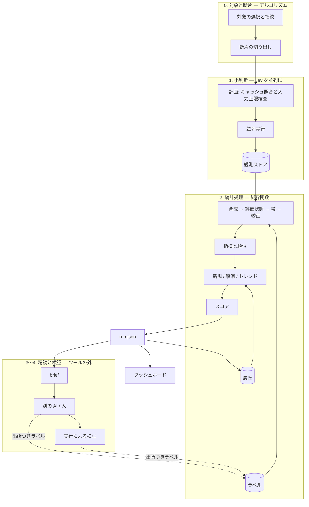

# jev-checkup (仮称) — 設計

> 状態: 設計の第 4 版。スパイク実装・予備評価とフェーズ 1 の本体実装あり。独立評価・フェーズ 2 は未完了。
> 日付: 2026-09-20
> [IDEA.md](IDEA.md) が「なぜ・何を」、この文書が「どう作るか」。IDEA.md の内容は繰り返さず参照する。
> レビュー指摘を取り込む方針と予算制御の要件除外は合意済み。本版はその具体化であり、未測定の性能や有用性を確定したものではない。
> 方針: 目的とコンセプトから逆算し、**要るものだけ**で組む。要らないと判断したものは 13 章に理由つきで並べた。

## 1. 設計が満たすべきもの

**命題**: 静的に検査できない健康性を、検査可能にする。
**プロダクト**: コードベースの健康性ダッシュボード — 総合スコア / 観点別スコア / トレンド / 指摘を一体として健康状態を表す (決定 D)。

IDEA.md は「検査可能である」を 3 つの条件で定義した。設計の各部は、このどれかを成り立たせるためにある。

| 満たすべきもの | それを成り立たせる仕組み | 章 |
| --- | --- | --- |
| **観測できる** | 対象 → 断片 → 原子的な質問 → Jev の並列な小判断 | 5 |
| **どこまで信用できるかがわかる** | 生の値の保存、ラベルと観測の結合による較正、「測れていないもの」の表示 | 5.6、6.2、6.7、7 |
| **時間を追って比べられる** | 指紋、測定条件の版、実行の履歴 | 5.1、6.5、6.6 |
| 設計原則: 読む価値のある問題を届ける | 順位、brief、上位 N 件の有用率の自己測定 | 6.3、8.2 |
| 決定 A: Jev は並列のセンサー | 漏斗 | 4 |

## 2. 設計の要点

全体を形づくる判断は 5 つ。

1. **Jev は漏斗の 1 段にだけいる。** 小判断を観測し、合成・判断不能・順位・スコアはコードで決める。
   `verdict` は判断不能を検出する補助であり、健康スコアや説明文をモデルに生成させない。
2. **観測は高くて不変、導出は無料で純粋。** 生の応答を残し、合成・閾値・較正を変えたら導出し直す。
   導出より後ろは Jev の呼び出しも API キーも要らない。GitHub への投稿は別の出力処理。
3. **識別するものを分ける。** 対象の指紋、観測入力のハッシュ、ラベルが判断した元コードの版、測定条件、スキャン範囲は別の役割を持つ。
4. **ラベルはコードについての言明。** 対象と判断した命題・元コードが同じなら、質問や切り出し方を変えても再利用できる。
   較正だけを変えた場合は、同じ条件の過去の集計を現在の較正表で計算し直す。
5. **`run.json` が提示の接点。** 描画・brief・GitHub 投稿に必要なデータを持ち、履歴も同じ形式で保存する。
   brief 用の指摘の断片を含むため、ソースコードを含む成果物として扱う。

## 3. 全体構成



## 4. 漏斗 — 安く広く → 高く狭く

監査で実際に成果を出した流れ (Jev で当たりをつける → 人とエージェントが精読する → ミューテーションで確かめる) を、そのまま構造にする。
段が進むほど 1 件あたりは高くつき、件数は絞られる。各段の仕事は、次の段が読む価値のあるものを選ぶこと。

| 段 | 担い手 | 1 件あたり | 件数の規模 | 出すもの |
| --- | --- | --- | --- | --- |
| 0. 対象と断片 | アルゴリズム (AST) | ほぼ 0 | 全部 (万) | 対象、指紋、判断に要る最小の断片 |
| 1. 小判断 | **Jev を並列に** | 〜$0.0001 | 全部 | 確率の行列 (対象 × 質問) |
| 2. 統計処理 | コード | 0 | 全部 | 較正済みの確率、順位、スコア、トレンド |
| 3. 精読 | 別の AI / 人 | 数セント〜数分 | 上位の数十件 | 仮説、検証の手順、ラベル |
| 4. 実行による検証 | ミューテーションなど | 秒〜分 | 数件 | 事実、ラベル |

**このツールが実装するのは段 0〜2 と、段 3 への受け渡し (brief)。** ダッシュボードは段 2 の出力から作る。
段 3・4 はツールの外にあり、結果はラベルとして戻ってきて、ダッシュボードの信用 (較正) を上げる。

## 5. 観測

### 5.1 対象・観測入力・ラベルの識別

対象は ast-grep のパターンで選ぶ。次の値を混同しない。

| 値 | 定義と用途 |
| --- | --- |
| `fingerprint` | `hash(観点 ID + リポジトリ相対パス + 安定した識別情報)`。履歴で対象を追う |
| `inputHash` | `hash(実際に送信する state の正規化表現)`。切り出し済みコード、本番コード、対象指定を含む。観測キャッシュに使う |
| `subjectRevision` | `hash(命題の版 + evidenceSources のパス・元ファイルの内容ハッシュの整列リスト)`。ラベルの再利用を判断する。切り出し方・行番号の付与・モデルは含めない |

テストの識別情報は `describe` の連鎖 + テスト名 (同名は出現順)、名前の観点は種別 + 修飾名 (`function:formatBytes`、`Class.method`)。
行番号は指紋に使わない。リネームや移動は削除 + 新規に見えることを表示する。

`evidenceSources` はラベルの判断に使った元ファイルを記録する。テストでは元のテストファイル全体と、解決できた本番モジュールを基本とし、
精読で別の fixture などに依存した場合はそのファイルも加える。元ファイルを使うため、兄弟を畳むかどうかでラベルは失効しない。
元ファイルのどこかを編集した場合は保守的に再確認対象になる。より細かい依存追跡は最初の版では作らない。

### 5.2 断片

観点ごとに切り出し方とその版を持つ。

| 観点 | 断片 |
| --- | --- |
| テスト | **他テストの本体を畳んだファイル + 解決できた本番モジュール全文**。import、モック、fixture、ヘルパー、フック、他テストのタイトルと対象テストを残す |
| 名前 (関数) | 宣言全体 (doc コメント、シグネチャ、本体) |
| 名前 (変数) | その変数を含む関数 |
| 名前 (モジュール) | トップレベル宣言一覧 (本体は省く) |

テストでは `state.target_tests` の名前付きフィールドに対象のタイトル・所属・コードを置き、1 リクエストに対象を 1 つだけ指定する。
他テストのタイトルや短いテストが残ることはあるため、取り違えが構造上不可能とはしない。対照質問の実施数・欠測・失敗を記録する。
畳み込みでは元の改行数を保ち、対象コードと元の行 ID の対応を保持する。

本番モジュールはテストファイル名 (付加名を除いた名前を含む) と一致する、モックされていないローカル import から一意に解決する。
一致がない・複数候補・許可された読み取り範囲外なら任意の import を選ばず、テストファイルのみ (`contextMode: focus`) にする。
追加できた場合は `focusprod`。解決方針・切り出し方の版と、実際のモード・ファイル・省略理由を残す。
送信する本番コードにも include / exclude を適用する。
明示された空の include は対象なしとする。フェーズ 1 は相対 import、TypeScript の実行時拡張子からの置換、index モジュールの名前一致を扱い、tsconfig のパスエイリアスは未対応として省略理由を表示する。

入力上限は **`state` + 最長の質問で 32k トークン、`state` + 全質問で 64k トークン** (固定モデルの仕様)。質問には instructions と criteria を含める。
事前検査は両方を対象にする。正確なトークナイザを使えない間は保守的な近似とし、上限を保証できるとは表示しない。
本番モジュールを加えると上限を超える場合は、計画時に全文の追加を取りやめて `focus` と省略理由を記録する。
テスト側だけでも超える場合は `unjudgeable / input_limit`。黙ってコードを切り詰めない。
API が入力長超過を返した場合も同じ理由で記録し、近似誤差として表示する。

[スパイク](spike/RESULTS.md) では、本番コード追加で判断不能が 86 件中 14 → 6 件に減った。
これは今回のエージェント一次ラベル上の予備結果で、他リポジトリでの解決率や有用性を保証しない。
本番コードがあっても不足する外部文脈はあり、6.1 の `cannot_tell` を残す。

### 5.3 質問

- 英語、原則 1 質問 1 条件。問題の質問は **yes = 問題の兆候** に揃える。否定した質問の確率を裏返して再利用しない。
- 判断不能・対照質問は別の役割を明示する。テストでは Noul の小判断、Score の assertion specificity、Choice の `verdict` を使う。
  `verdict` は判断不能の分岐だけに使い、`suspicion` に加算しない。
- 数や行範囲はコードで扱う。質問文に判定閾値を書かない。
- **1 リクエスト = 1 対象の state + 必要な質問群**。各質問は独立に評価される。入力・出力の型も観点定義に含める。
- テストの初期質問は [questions.json](spike/test-honesty/questions.json)、合成は [questions.md §3](spike/test-honesty/questions.md#3-composition-rule) に基づく。
  起草済み質問や保存済み応答は今回の設計改訂で変更しない。名前の観点は別途検証し、テストの精度を引き継がない。

### 5.4 計画と入力上限

- **計画は純粋関数**: (対象、断片、質問、観測ストア) → 送信予定・キャッシュ利用・入力上限などによる除外の一覧。
- `--dry-run` は対象と送信先ファイルの一覧、リクエスト数、キャッシュ利用、文脈の省略理由を示し、何も送らない。通常実行も同じ計画を通る。
- **予算制御は要件外。** `--max-cost`、既定の金額上限、予算ゲート、費用による実行中停止は作らない。
  費用の上限管理は利用者が外部で行う。API 側の利用制限などを使う場合は、その提供内容を利用者が確認する。
- 概算費用表示・見積もり係数の自動補正も MVP 必須ではない。API が返す実測 usage は記録する。

### 5.5 並列実行

1 対象 = 1 リクエスト。公称 1,200 req/分なら 8,700 対象は約 7 分、22,800 対象は約 19 分だが、実効スループットは未検証。
2 回目以降は観測キャッシュを使う。

- 同時接続数の上限と req/分 のリミッタを持つ。250k tok/秒の制限にも従い、本番コードを加えた断片ではトークン側が律速になりうる。
- 429 / 529 の再試行は SDK に任せ、繰り返し出たら発行レートを下げる。動的な制限のため既定は公称値より控えめにする。
- 結果は届いた順に観測ストアへ保存する。中断・エラー後はキャッシュにない分を送ればよい。
- 再試行後も応答が得られない対象は `unevaluated`。不正・欠損した応答は `not_judged` とし、正常な評価に混ぜない。

### 5.6 観測ストア

- キーは小判断単位: `hash(実モデル版 + inputHash + 質問の型・instructions・criteria)`。実際の state が変われば再観測する。
  合成式・閾値・較正の変更では再観測しない。
- 値は生の応答全体 (Noul / Score / Choice の必要な各フィールド)、実モデル版、usage、時刻。usage はリクエスト ID に紐づけ、質問ごとに重複計上しない。
- 観測ストアには送信コードを保存しない。ただし断片や回答の文言を含む `run.json` / brief とは保存範囲が異なる (8.2、11 章)。
- 形式はキーごとの JSON。場所は `--state-dir` (既定 `.jev-checkup/`)。SQLite などのネイティブ依存は持ち込まない。
- 実モデル版を固定する。版の変更は測定条件を変えるため基準線をリセットし、勝手に更新しない。

## 6. 統計処理

### 6.1 合成 → 評価状態 → 帯

テストの観点はスパイクで実測した合成を初期案として採用する。各記号は質問の生の値を表す。

```text
core    = max(outcome_unasserted, result_claim_call_only,
              call_claim_no_call_check, subject_not_in_play)
partial = max(extra_claim_unasserted, general_claim_single_case)
weak    = P(specificity = last level) + 0.5 * P(specificity = middle level)
gate    = max(core, partial, vague_title)
suspicion = 0.60 * core + 0.25 * partial * (1 - core) + 0.40 * weak * gate

strong = core >= 0.80 or partial >= 0.80
controls_ok = 実施した own 対照 >= 0.50 かつ sibling 対照 <= 0.50

以下を上から順に適用する:
not_judged  : 応答不正・必要な回答の欠損、または not controls_ok
cannot_tell : not strong and (hinges_on_unseen_rule >= 0.70
                              or verdict.choice == "cannot_tell_from_file")
              または not strong and 0.35 < core < 0.65 and verdict.confidence < 0.50
finding     : suspicion >= T_FIND
clean       : その他

T_FIND = 0.30
signal = suspicion - T_FIND
band (finding のみ) = [0, 0.05) / [0.05, 0.15) / [0.15, 0.30) / [0.30, +∞)
```

対照用の断片が取れず質問を省いた場合は `not_available` を保存し、成功件数に数えない。
実施した対照だけで `controls_ok` を判定する (スパイクの扱い)。省略予定ではなかった回答の欠損は応答不正。
`suspicion` は順位付けのための合成値であり、較正された確率ではない。0.50 は開発データで調べた代替閾値で、既定にはまだ採用しない。
帯も新しい合成値に対する候補であり、従来手法の帯別実績をそのまま流用しない。

全対象は次のいずれかを持つ。

| outcome | 意味 | スコアの評価数に入れるか |
| --- | --- | --- |
| `finding` | 判定可能で指摘あり | 入れる |
| `clean` | 判定可能で指摘なし | 入れる |
| `cannot_tell` | 文脈不足・判断の不確かさ | 入れない |
| `not_judged` | 対照失敗・応答不正 | 入れない |
| `unjudgeable` | 入力上限などで観測できない | 入れない |
| `unevaluated` | 中断・API エラーで評価未完 | 入れない |

`cannot_tell` を `clean` や解消に変換しない。強い小判断が判断不能を上書きする規則も検証対象であり、正しさを保証しない。
指摘の理由は質問文・生の応答・合成への寄与から示し、モデルによる叙述は生成しない。
名前の観点の合成式・閾値・帯は別の観点定義で決める。

### 6.2 較正 = ラベル ⋈ 観測

ラベルは `fingerprint` と `propositionVersion` で候補を探し、ラベルの `evidenceSources` を使って現在の `subjectRevision` を再計算して一致を確認する。
観測時の基本の証拠リストにないファイルを精読者が追加した場合も、そのラベルのリストで検証する。各元ファイルが現在も存在し、内容ハッシュが一致することが必要。
切り出し方の変更だけでは失効しない。命題の変更、証拠ファイルの変更・欠落は再確認対象にする。

```text
P(valid | band) = (帯内の valid + 事前の valid) / (帯内の valid・invalid 件数 + 事前件数)
P(high | valid, band) = valid かつ優先度が付いたラベルのうち high の割合 (同様に事前件数を加える)
```

- `unknown` は正誤の分母に入れない。判断不能の観測や、`clean` のラベルを finding 用の帯へ混ぜない。
- 較正表は **観点・測定条件・contextMode ごと**に作る。事前値は対応する同梱コーパスから来る。
  コーパスは元コードと出所つきラベル、生の観測を持つ。閾値・合成変更時は生の観測を再集計し、モデル・質問・state 変更時は再観測する。
- `local` / `corpus` / `none` をモードごとに表示する。適合する表がないモードの確率は `null`。
  一部の指摘に確率がない観点も、部分的な確率を使って総合点に入れない。
- `agent` ラベルは開発・予備較正には使えるが、出所別件数と `validation: provisional` を表示する。
  **較正や有用性の確定評価に使うのは `human` / `execution` のみ**。実行が確認していない優先度を `execution` と扱わない。
- 毎回結合して導出するが、その実行で用いた表・条件・出所別件数は `run.json` に保存する。これで `report` はラベルや観測ストアを読まず再現できる。

### 6.3 順位

較正がある観点では `P(valid | band) × P(high | valid, band)` の降順、同点は `suspicion` の降順。
較正表が不足している観点は `suspicion` の降順で「未較正」と明記し、較正済みの確率順位と混ぜず観点別に提示する。
**今回のスパイクが測ったのは suspicion 順**であり、帯で較正した最終順位の有用性はまだ測っていない。

- `accept` / `defer` / `dismiss` は上位 N 件から外して別枠に表示する。判定結果と対応状況は分離する。
- 前回の上位 N 件を保存し、「有用 k / 有用でない j / 未確認 m」を表示する。ここでの有用はメンテナが対応価値ありと判断した `valid + high` とする。
  `agent` の一次判定は別集計とし、人の有用率の未確認を埋めない。
- 母集団の Precision@N は全対象を順位付けしてからその上位を確認する。従来手法の指摘集合や無作為標本内の結果だけで、全体の上位が保たれるとは言わない。

### 6.4 スコア

- 観点スコア = `1 − Σ finding の P(valid | band) / (finding 数 + clean 数)`。
  判断不能・未評価を正常として分母に入れない。分母が 0、または必要な較正表がない場合は `score: null`。
- 総合点はスコアを計算できる観点の加重平均。重みと含めた観点を必ず表示し、観点が 0 なら `null`。
- 未解決数、評価数、評価できない状態の内訳、較正の出所・検証状態、範囲、測定条件を必ず添える。
- 100 点を目指すゲートにはしない。終了コードにも使わない。

### 6.5 測定条件とスキャン範囲 — 比べてよいかを決める

```text
condition = hash(実モデル版 + 命題の版 + 選択パターンと解析器の版
                 + 切り出し・本番モジュール解決・フォールバック方針の版
                 + 質問の型・instructions・criteria
                 + 合成式と重み + 全判定閾値・判断不能規則・対照規則 + 帯の定義)
scopeId = hash(repositoryId + 正規化した paths・include・exclude + 対応言語・ファイル選別方針)
```

`condition` は観点ごと。コードの内容は含めない。`scopeId` は指定範囲を識別し、現在そこにあるファイルの一覧は含めない (削除・追加を検出するため)。
実際の列挙結果・対象一覧は別に保存する。`repositoryId` は場所を移しても同じリポジトリを識別する値で、Git remote の認証情報は保存しない。

- 比較は同一 repositoryId・scopeId・condition の実行に限る。範囲が変わったら「スキャン範囲が異なるため比較なし」と表示する。
- ラベルだけを変えた場合は基準線をリセットしない。同条件の過去の **contextMode 別の帯件数と評価数**を現在の較正表で再計算する。
  `report` が使う現在の表も読み込んだ `run.json` のものとし、ファイル上の最新ラベルを暗黙に読み直さない。
- 同じ対象でも `focus` ↔ `focusprod` に変わった場合は文脈条件が異なる。対象の新規 / 解消判定を保留し、その観点のスコア前回比を出さない。
- 観点・重みが違う総合点の前回比は出さない。観点単位の比較可否は独立に判定する。

### 6.6 新規 / 解消とトレンド

履歴は過去の `run.json` を積んだディレクトリ。CLI は `--history <dir>` を読む。
通常の比較先は同一範囲・同一条件の直近の完了実行。

- 全対象の `fingerprint`・位置・contextMode・outcome と、ファイル列挙の成否を保存する。指摘一覧にないことを削除の証拠にしない。
- `value_dropped`: 前回 finding の対象を同じ contextMode で再評価し、今回 `clean` になった場合だけ。
- `target_gone`: 同じ範囲の列挙と必要な解析が完了し、対象がコードからなくなったと確認できた場合だけ。修正による解消とは分ける。
- 判断不能・未評価・解析失敗・文脈条件の変更は解消でも新規でもなく「比較保留」。過去の未解決指摘を持ち越す。
  次回は履歴を遡り、その対象の同条件での最後の確定状態と比較する。参照した実行 ID を残す。
- `complete: true` は列挙と、安全に選択できた対象について予定した処理の完了を表す。`cannot_tell` や確定した入力上限超過は完了実行にも存在する。
  パーサが回復して AST を返した場合、診断と重ならないテストのみ選択し、重なるテスト・suite は省略してファイル単位の診断を保存・表示する。診断のあるファイルでは対象の不在を新規 / 解消の根拠にしない。
  中断、未回復の API エラー、応答不正・対照失敗、列挙失敗、回復できない解析失敗は `complete: false`。不完全実行は次回の基準にせず、表示にも不完全と明記する。
- トレンドの主役は新規 / 解消と比較保留の件数。判定不能・未評価数も並べる。
- **スコア差のノイズ閾値は未確定。** 個別 suspicion の最大観測幅 0.038 から、スコア差の閾値 0.04 を導かない。
  同一コード・同一条件の反復で、判定境界と帯境界に近い対象を含め、最終スコア・新規 / 解消件数を実際に再集計して決める。
  確認まではスコア値の履歴を示すだけで、スコアの前回差や改善・悪化の強調は出さない。

### 6.7 測れていないもの

ダッシュボードに次を常設する。

- `cannot_tell` / `not_judged` / `unjudgeable` / `unevaluated` の件数と理由
- 本番モジュールの解決・追加・省略の件数、対照質問の実施・欠測・失敗
- 未対応言語・exclude・解析失敗で対象外だったファイル、比較保留の対象
- 較正の出所・予備評価の状態、母集団での Precision@N と見落とし率の未測定
- スコア差のノイズ閾値が未確定であること
- 日本語のテスト名・コメントでの精度低下や、コード内の記述による判定誘導の可能性

## 7. ラベル

```jsonc
// .jev-checkup/labels.jsonl — 1 行 1 件
{ "fingerprint": "7be1…", "propositionVersion": "test-title-honesty@1",
  "subjectRevision": "91c0…",
  "evidenceSources": [{ "file": "src/x.test.ts", "hash": "b13a…" }],
  "validity": "valid", "priority": "high", "resolution": "fix",
  "source": "human", "note": "省略を一度もアサートしていない" }
```

- 3 つの軸は IDEA.md のとおり: 正誤 → 較正 / 優先度 → 順位 / 対応状況 → ダッシュボードの表示。
- **リポジトリ内のファイルとして持つ。** PR でレビューでき、インフラ不要、オフラインで動く。
- **ラベルはコードについての言明で、判定値を含まない** (要点 4)。質問・閾値・モデルを変えても、判断する命題と evidenceSources の元コードが同じなら再利用できる。
- **出所を持つ**: `human` / `agent` / `execution` (ミューテーションなど実行で確かめた)。
  `agent` のラベルで較正を**評価**すると、その AI の偏りを正解として測ることになる。評価に使うのは `human` と `execution` だけ。
- 別の AI が書いた説明 (叙述) の居場所は `note` だけ。スコアには使わない。`run.json` に保存するラベルにも note は含めず、元のラベルファイルで読む。
- **コード内の抑制コメントは採用しない。** 「正しいが直さない」を invalid と誤学習する (IDEA.md) うえ、
  コメントは断片に入ってモデルを誘導し、キャッシュも無効にする。
- 最初の版に入力用の道具は作らない (決定 C)。手で書くか、brief を読んだ人や AI が書く。brief が記入用の行を含む (8.2)。
- 既存のスパイクラベルは旧形式の一次判定資料として保持する。本体へ取り込む際に命題・元コードの版・出所を明示し、agent を human / execution に読み替えない。

## 8. 提示

### 8.1 ダッシュボード

端末、Markdown、Job Summary、ピン留め issue に**同じ内容を同じ順**で出す (決定 D の図のとおり)。

1. **総合スコア** — 含まれた観点の数、重み、前回比 (比べられる場合のみ)
2. **観点別スコア** — 観点ごとに 1 行: スコア、未解決 / 新規 / 解消 / 比較保留、評価数、較正状態、測定条件の版
3. **トレンド** — 直近の比較可能な実行の表。条件が変わった所で線を切り、基準線のリセットとして示す
4. **指摘** — 観点別の上位 N 件。位置、根拠の質問と生の応答、帯、P(valid)、対応状況。続いて `accept` / `defer` / `dismiss` の別枠
5. **測れていないもの** (6.7) と、前回の上位 N 件の有用率 (6.3)

端末での姿 (例。数値は架空):

```text
Codebase Health  0.974   2 観点 / 等重み   スコア差のノイズ閾値: 未確定

観点              スコア  未解決  新規  解消   評価数  較正          条件
test-honesty      0.981      31     2     3    1,204  local (86)    c9f2
naming-honesty    0.967      58     5     1    7,514  corpus        a41b
unused                —      12     —     —        —  none          —      総合点に含めない

トレンド  test-honesty / 条件 c9f2
  09-06   未解決 33   新規 1   解消 0
  09-13   未解決 32   新規 0   解消 1
  09-20   未解決 31   新規 2   解消 3

読むべき指摘  上位 3 / 31
  1  src/x.test.ts  "omits linkLocalIpv6 section when array is empty"
     根拠: outcome_unasserted 0.91   帯 ≥+0.30   P(valid) 0.80
  ...

測れていないもの
  判定不能 3 / 未評価 0 / 対象外 12 ファイル / 見落とし率: 未測定
  前回の上位 10 件: 読む価値あり 6 / なし 2 / 未ラベル 2
```

根拠は 3 つに分類して混ぜない。

| 分類 | 出所 | 扱い |
| --- | --- | --- |
| 事実 | 静的解析、実行 | そのまま報告する |
| 推定 | Jev の判定値 + 較正 | 確率と、根拠の質問・生の応答を見せる。未較正なら確率は出さない |
| 叙述 | 別の AI が書いた説明 | 仮説。ラベルの `note` にだけ置き、ダッシュボードの数値には入れない |

### 8.2 brief — 別の AI・人への受け渡し

`jev-checkup brief run.json --top N` が、上位の指摘ごとに次をまとめた Markdown を書き出す。

- 位置と断片 (コードはデータとして区切って載せる)
- 根拠の質問と生の値、合成値、帯、P(valid) (未較正ならその旨)
- **確認できていないこと** (例: 「セットアップが主張の状況を作っているかは、断片の外の fixture による」)
- 検証の提案 (例: 「この条件を反転して、このテストが赤くなるか」)
- **記入用のラベル行** (fingerprint、propositionVersion、subjectRevision、evidenceSources を埋める。追加の外部文脈を読んだ場合は証拠ファイルを更新する)

`run.json` は finding 全件の評価時の state (必要なら inputHash ごとに重複排除) と質問定義を保持する。
brief はその保存値を使い、現在の作業ツリーを読み直さない。出力前に inputHash と保存 state の一致を検証する。
古い形式などで断片が欠ける場合は、別の版のコードで補わず「評価時の断片なし」として brief の生成を失敗させる。
report の通常表示・GitHub 投稿は断片を掲載せず、brief が明示的にコードを取り出す。

**brief の生成自体は LLM を呼ばない。** 第 2 のベンダーへの依存・API キー・非決定性を核に持ち込まないためで、
コードの第 2 の送信先を決めるのはツールではなく利用者になる。読み手は Claude Code でも、他のエージェントでも、人でもよい。

### 8.3 GitHub

- `report --format github` が `GITHUB_STEP_SUMMARY` に書き、ピン留め issue を upsert する (本文の隠しマーカーで同定)。
  issue 本文の上限 (65,536 文字) があるので上位 N 件に絞る。ピン留めは 3 件までなので、失敗しても issue の更新は続ける。
- Action は CLI を呼ぶだけの composite action。
- **履歴は専用ブランチに積む** (IDEA.md)。`actions/cache` は 7 日間アクセスが無いと消えるので、週次スキャンの履歴には向かない。
  観測ストアは `actions/cache` でよい (消えても再構築できる)。ブランチの出し入れは Action の仕事で、CLI は `--history <dir>` しか知らない。

## 9. 事実源の観点 (knip / jscpd)

決定 C の 4 観点のうち、未使用と重複は事実源から来る。Jev の観点と同じ形に載せる。

| | 未使用 (knip) | 重複 (jscpd) |
| --- | --- | --- |
| 実行 | 利用者のプロジェクトに入っているものを利用者の設定で。無ければ「未測定」 | 同梱の依存として実行 |
| 指紋の識別情報 | 報告種別 + シンボル名 | 重複断片の正規化した中身のハッシュ |
| 帯 | 報告種別 (files / exports / dependencies) | 断片の大きさ |
| 報告の名前 | 「参照グラフ上で未使用」 | 「重複候補」 |
| 測定条件 | ツールの版 + 設定のハッシュ | 同左 |

- ラベルが無いうちは較正状態が `none` なので、**表示されるが総合点には入らない**。
- 未解決: 分母。knip は export の総数を返さない。提案は、対象の選択で export を数えること。重複は jscpd の重複行率を使う。
- **作る順番は最後にする。** このツールの独自の価値は Jev の観点の側にあり (IDEA.md の未決事項)、
  削るならここから削る。先に作る 2 観点だけでもダッシュボードは成立する。

## 10. CLI、設定、`run.json`

```text
jev-checkup scan [paths...]      観測 → 導出 → run.json を書き、端末にダッシュボードを出す
    --dry-run                    対象・送信予定・キャッシュ利用・除外理由を表示 (何も送らない)
    --history <dir>              過去の run.json (新規 / 解消とトレンドの比較元)
    --state-dir <dir>            観測ストアの場所 (既定 .jev-checkup/)
    --out <path>                 run.json の書き出し先

jev-checkup report <run.json>    保存済みダッシュボードを描画 / 投稿 (Jev は呼ばない)
    --history <dir>  --format <terminal|markdown|github>

jev-checkup brief <run.json>     上位 N 件を、別の AI や人に渡す形にする (何も送らない)
    --top <n>
```

- **指摘ではビルドを落とさないが、ツールが仕事をできなかったときは非 0 で終わる**
  (設定の誤り、認証の失敗、未回復エラーや中断による不完全実行)。定期ジョブが緑のまま何もしていない状態を避ける。
- 閾値や較正を変えた後の再計算に専用のコマンドは要らない。`scan` をもう一度回す。同一コード・質問・モデルの観測が残っていれば API を呼ばず導出し直せる。キャッシュが失われた場合は再観測が必要で、dry-run で確認できる。
- 設定は宣言的なファイル (YAML) + JSON Schema。測定条件の版を安定してハッシュでき、読み込みでコードを実行しない。
  中身は include / exclude、モデル版、観点の有効・無効、重み、閾値の上書き。API キーは `TYPESAFE_API_KEY` からのみ読む。
- 同梱の観点定義 (選択パターン、切り出し方、質問文、合成規則・閾値・帯、固定の説明文) は同じ宣言的な形式のデータとして持つ。

`run.json` は自己完結した提示用スナップショット。全対象の一覧、比較先、較正表、条件の定義を保持する。
以下は形を示す例 (コード・ハッシュ・質問定義は説明用に省略)。本体では必要な定義・応答・state を省略せず保存する。

```jsonc
{
  "schema": 1,
  "tool": "0.1.0",
  "run": { "id": "run-002", "at": "2026-09-20T03:00:00Z", "commit": "abc1234", "dirty": false, "complete": true },
  "scope": {
    "repositoryId": "repo-01", "id": "scope-01", "paths": ["src"],
    "include": ["**/*.test.ts"], "exclude": [], "languages": ["typescript"], "selectionPolicy": "files@1",
    "enumerationComplete": true, "files": [{ "file": "src/x.test.ts", "status": "parsed", "hash": "b13a…" }]
  },
  "aspects": [{
    "id": "test-honesty", "condition": "c9f2…",
    "definition": { "propositionVersion": "test-title-honesty@1", "model": "jev-1.13.0", "selector": "tests@1", "parser": "parser@1",
      "contextPolicy": "focusprod-or-focus@1", "composition": "test-honesty@1", "weights": [0.60, 0.25, 0.40, 0.5],
      "thresholds": { "strong": 0.80, "unseen": 0.70, "midLow": 0.35, "midHigh": 0.65, "confidence": 0.50, "finding": 0.30, "control": 0.50 },
      "bandEdges": [0, 0.05, 0.15, 0.30], "questions": "保存する質問定義全体" },
    "calibration": { "validation": "provisional", "byContextMode": {
      "focus": { "source": "none", "labelsBySource": { "human": 0, "agent": 0, "execution": 0 }, "table": null }
    } },
    "evaluated": 2, "cannotTell": 1, "notJudged": 0, "unjudgeable": 1, "unevaluated": 0,
    "bandsByContextMode": { "focus": { "0..0.05": 0, "0.05..0.15": 0, "0.15..0.30": 0, ">=0.30": 1 } },
    "open": 1, "score": null, "inTotal": false,
    "comparison": { "baselineRun": null, "new": null, "resolved": null, "pending": 0, "reason": "no_baseline", "scoreDelta": null, "noiseFloor": null }
  }],
  "targets": [
    { "fingerprint": "7be1…", "aspect": "test-honesty", "location": { "file": "src/x.test.ts", "startLine": 120, "endLine": 141 },
      "contextMode": "focus", "contextReason": "no_unique_named_import", "outcome": "finding", "inputHash": "in-01", "subjectRevision": "91c0…" },
    { "fingerprint": "t2", "aspect": "test-honesty", "location": { "file": "src/x.test.ts", "startLine": 150, "endLine": 165 }, "contextMode": "focus", "outcome": "clean" },
    { "fingerprint": "t3", "aspect": "test-honesty", "location": { "file": "src/x.test.ts", "startLine": 170, "endLine": 190 }, "contextMode": "focus", "outcome": "cannot_tell", "reason": "unseen_rule" },
    { "fingerprint": "t4", "aspect": "test-honesty", "location": { "file": "src/x.test.ts", "startLine": 200, "endLine": 900 }, "contextMode": "focus", "outcome": "unjudgeable", "reason": "input_limit" }
  ],
  "findings": [{
    "fingerprint": "7be1…", "aspect": "test-honesty", "status": "uncompared", "rank": 1,
    "evidence": { "inputHash": "in-01", "answers": "保存する生の応答全体", "suspicion": 0.61, "signal": 0.31, "band": ">=0.30", "pValid": null, "pHigh": null },
    "labelTemplate": { "fingerprint": "7be1…", "propositionVersion": "test-title-honesty@1", "subjectRevision": "91c0…", "evidenceSources": [{ "file": "src/x.test.ts", "hash": "b13a…" }] },
    "label": null
  }],
  "snapshots": { "in-01": { "state": "評価時の state 全体" } },
  "topFindings": { "test-honesty": ["7be1…"] },
  "resolved": [], "pendingComparisons": [],
  "total": { "score": null, "aspects": 0, "weights": { "test-honesty": 1 } },
  "unmeasured": { "skippedFiles": 0, "missRate": null, "populationPrecisionAtN": null },
  "usage": { "requests": 3, "inputTokens": 12000, "cacheHits": 0 }
}
```

`findings.status` は `new / persisting / uncompared`。比較保留の過去の指摘は `pendingComparisons` に指紋と最後の確定実行 ID・理由を残す。
`resolved` にも比較元の実行 ID と `value_dropped / target_gone` を保存する。
較正表がある場合は各帯のラベル件数・事前件数・P(valid)・P(high | valid) を保存する。
集計の `bandsByContextMode` は finding だけを数え、スコアの分母は別の `evaluated` を用いる。


## 11. 信頼境界

| 境界 | 脅威 | 対応 |
| --- | --- | --- |
| ソースコード → typesafe.ai | private なコードが外に出る | README 最上部に書く。`--dry-run` は何も送らない。include / exclude で絞れる |
| brief → 別の AI | コードの第 2 の送信先 | ツールは送らない。渡す先は利用者が決める |
| 評価対象のコード → モデル | コメントや文字列で判定を誘導できる (公式に既知の弱点)。brief 経由で精読側にも届く | 指摘でビルドを落とさないので誘導の利得が小さい。「測れていないもの」に明記。brief ではコードをデータとして区切る |
| 観測ストア / ラベル / 履歴 | 書き換えれば指摘を消せる | 既定ブランチと同じ権限でしか書けない場所に置く。fork PR からは読み取りのみ |
| `run.json` / brief / 履歴 | 指摘の断片に private なソースが含まれる | 元コードと同じ公開範囲で保存する。公開 issue には断片を出さない。観測ストアにコードを保存しないことと混同しない |
| API キー | 漏洩 | 環境変数のみ。設定ファイル・ログ・`run.json` に出さない |
| fork PR | シークレットが無い | 評価を skip したと明示し、失敗にしない (IDEA.md) |

## 12. 技術選定

| 項目 | 選定 | 理由 |
| --- | --- | --- |
| 言語とランタイム | TypeScript / Node 20+ | 公式 SDK (`@typesafe-ai/sdk`)、ast-grep、knip、jscpd がすべて npm。テストベッドも TS |
| 構成 | 単一パッケージ | 分ける理由がまだ無い |
| 対象の選択と断片 | ast-grep (`@ast-grep/napi`) | 宣言的なパターンで選べ、兄弟ノードの除去も同じ道具でできる。Rust にも届く |
| Jev との境界 | 観測の 1 モジュール (`observe/`) に閉じる | API や料金が変わる前提 (IDEA.md)。差し替えの仕組みは作らない |
| Action | composite action | CLI を呼ぶだけ。バンドルした `dist` の管理が要らない |

```text
src/
  cli/        引数、終了コード
  config/     設定のスキーマと読み込み
  aspects/    同梱の観点定義 (データ)
  select/     対象の選択、指紋、断片の切り出し
  plan/       キャッシュ照合、入力上限、送信予定
  observe/    Jev の呼び出し、並列実行、観測ストア
  derive/     合成、評価状態、帯、較正、順位、スコア、履歴との比較
  report/     terminal / markdown / github / brief
corpus/       同梱コーパス (断片 + 出所つきラベル)
spike/        使い捨てのスクリプト
action.yml
```

依存の向きは `cli → select / plan / observe / derive / report`。`derive` と `report` は `observe` を知らない。

## 13. 作らないもの

検討して、今は要らないと判断したもの。右の列が成り立ったら見直す。

| 作らないもの | 理由 | 見直す条件 |
| --- | --- | --- |
| LLM の内蔵、MCP サーバ | brief で受け渡せる。核に第 2 のベンダーを入れない | brief の手渡しが実運用で面倒だとわかったら |
| Jev 以外の検出器を差し替える仕組み | 境界を 1 モジュールに閉じれば足りる。較正は引き継げないので、差し替えても得が薄い | 使いたい別のモデルが具体的に出てきたら |
| 陽性だけ文脈を広げて訊き直す (2 段の観測) | 本番コードは送信前に解決・追加する。追加しても足りない文脈は判断不能として扱う | 2 段化の追加費用・精度の効果を測れたら |
| 複数の対象を 1 リクエストに束ねる | 無関係な内容と対象の取り違えが戻ってくる | 初回の 7〜19 分が実際に問題になったら |
| 質問の言い換えによる不確かさの推定 | 効くかどうか未確認。質問の作成と較正の手間が倍になる | スパイクで、不一致と誤りの相関が出たら |
| 学習した重み (回帰など) | 初期値は起草時の固定重み。学習による改善は未検証 | ラベルが増え、独立評価ができたら |
| スコアの区間推定、ヒステリシス | 当面はスコア差を強調せず、ノイズは未測定と表示する | 最終集計の揺れを測り、必要性が出たら |
| 予算制御・必須の概算費用表示 | 上限管理は利用者の外部手段に委ねる。実測 usage と dry-run は残す | 内部で制御する具体的な要件が出たら |
| ユーザー定義の観点の公開スキーマ | 同梱の観点定義はデータだが、形式を公開すると固定される | 同梱の 2 観点の形式が落ち着いたら |
| 静的ページのダッシュボード | Job Summary と issue で足りる (IDEA.md の未決事項) | — |
| PR モード、`--fail-on`、ラベル付けの道具、再較正、無作為サンプルの brief、ミューテーションのアダプタ | 決定 C で次の版 | — |

## 14. 進め方

| フェーズ | 内容 | 終わりの条件 |
| --- | --- | --- |
| **0. スパイク** | テストの質問・合成・文脈を予備評価し、独立評価を行う | 以下の未確認事項を評価し、IDEA.md の撤退条件で go / no-go |
| **1. 歩く骨格** | 選択 → 観測 → 評価状態 → 較正 → run.json → 履歴 → ダッシュボード → brief | 1 観点で保存・比較・受け渡しの契約を満たす。試作の継続と有用性の確定は区別する |
| **2. 最初の版の残り** | 名前の観点、Markdown / GitHub、composite action、最後に knip / jscpd | 定期スキャンとダッシュボードの更新が回る |

フェーズ 1 の実装範囲・契約は [IMPLEMENTATION.md](IMPLEMENTATION.md)、利用方法は [README.md](README.md) に記録する。Markdown のローカル出力は brief と合わせて先行実装した。実装の確認には一時リポジトリと保存済み応答を使い、API の追加呼び出しや独立した有用性評価は行っていない。

### スパイクで確認したことと残す評価

[RESULTS.md](spike/RESULTS.md) は予備評価の記録。保存済み応答はそのまま残す。
修正前後 13 対の suspicion 低下、本番コード追加による判断不能 14 → 6 件、評価用の上位 10 件中 high 7 → 8 件は再集計できた。
ラベルは Claude の一次判定であり、母集団に対する有用率・最終的な較正順位の評価ではない。

残す評価は次のとおり。

1. **出所を確かめる。** 評価用の人による確認・実行による検証を記録する。既存の agent ラベルを正解へ自動昇格させない。
2. **母集団の上位を確認する。** 事前に対象範囲・N・比較手法を固定し、同じ母集団の全対象を順位付けした後で、上位をメンテナが確認する。
   同じ N 件を無作為に読む場合と従来手法の上位を読む場合を比較する。標本 60 件の最大値から未観測 720 件の上位を推定しない。
3. **最終の順位・較正を評価する。** 開発用にだけ質問・重み・閾値・帯を合わせ、凍結後に独立した評価用ファイルで P(valid) と Precision@N を測る。
   現在の評価用を見て選んだ文脈や方式は、新しい独立評価で確認する。予備評価の suspicion 順を較正済み順位の実績と扱わない。
4. **最終集計の揺れを測る。** 判定閾値・判断不能・帯境界に近い対象を含め、同一コード・条件で反復する。
   スコア・新規 / 解消件数・上位 N 件の入れ替わりを実際に計算し、スコア差を表示する基準を決める。0.04 は採用しない。
5. **残る運用仮説を測る。** 本番コード込みの実効スループット、入力上限の近似誤差、コメント誘導への感度、brief を使った精読の有用性。

見落とし率のための未指摘標本の確認も継続する。未知の項目は未測定と表示し、未確認の結果をリリースの根拠として書かない。

### clean-room の運用

実装は、この文書・IDEA.md・clean-room で起草したスパイクの質問・合成規則・公開 API ドキュメントに基づいて行う。jev-lint のソース、同梱ルール、
エージェント向けの jev-lint スキルは読まない (この設計も読まずに書いた)。比較はブラックボックスの実行結果に限る。

## 15. リスク

| リスク | 影響 | 手当て |
| --- | --- | --- |
| 断片の外にある前提 | 判断不能や誤検知 | 本番コード追加と cannot_tell。予備評価を他リポジトリの精度保証にしない |
| リクエスト数が律速 | 初回スキャンが 20 分規模 | キャッシュで 2 回目以降は差分だけ。止まっても続きから |
| ラベルが少なく agent の一次判定に偏る | 較正も順位も不安定 | 予備評価と確定評価を分け、母集団の上位を人が確認する |
| `agent` ラベルの偏り | 較正が AI の癖を学ぶ | 出所を分け、評価には `human` / `execution` だけ |
| コメントによる誘導 | 指摘を意図的に消せる | 11 章 |
| モデル版の更新 | 基準線がリセットされる | 版の固定。ラベルは生き残るので、較正は訊き直すだけで戻る |
| 名称に `jev` を含めてよいか / データの保存期間 | 公開の可否、README の文言 | TypeSafe に確認 (未了)。Jev が部品の 1 つになったので、名称は見直す余地もある |

## 付録: 公開ドキュメントから判明した制約

<https://docs.typesafe.ai> より。設計を動かしたものだけ。

| 事実 (出典ページ) | 設計への影響 |
| --- | --- |
| 「質問に関係する文脈だけを含めよ」「できるだけ狭く原子的な質問を」。無関係な内容は精度を下げる (how-to-build、model-jaggedness) | 5.2 断片、5.3 質問 |
| `state` + 最長の質問で 32k トークン、1 リクエスト 64k (models) | 5.2 判定不能 |
| 1,200 req/分・250k tok/秒、制限は動的。課金は入力のみ $0.042/M (models) | 5.5 並列実行 |
| `state` は 1 回だけ課金。同一リクエスト内の質問は独立・並列 (cookbooks/parallel_questions) | 5.3 1 リクエスト = 1 断片 + 全質問 |
| 同じ入力の繰り返しはほぼ決定的。標準偏差は平均 0.01 程度、境界付近で 0.43〜0.53 の幅 (cookbooks/consistency_noul) | 6.6 ノイズの床 |
| 「不確かなものは人か、より高価な推論モデルへ」。カスケードのゲートは最大値 (how-to-build、cookbooks/sde_cascade) | 4 漏斗、6.1 質問群内の最大値 (全体の合成とは区別) |
| 「独立した答えを、決定的な規則か加重和でコード側で組み合わせよ」(how-to-build) | 要点 1 |
| Noul に `confidence` は無い (confidence) | 信頼度 = 自前のラベルで較正した P(valid) |
| 否定・間接的な指示・数値に弱い。P(q) と 1−P(¬q) は比較できない (noul、model-jaggedness) | 5.3 質問の規約 |
| `state` 内の誘導的な記述に引きずられる (model-jaggedness) | 11 信頼境界 |
| 主な学習言語は英語。CJK は精度が落ちる (state) | 5.3 質問は英語、6.7 |
| エイリアスは予告なく動く。応答に実モデル版が返る (models) | 5.6 版の固定 |
| 学習には使わないと明記。保存期間は DPA 参照、ZDR は enterprise のみ (legal) | README の文言。保存期間は未確認 |

## 改訂履歴

- 2026-09-20 初版
- 2026-09-20 第 2 版: Jev を並列のセンサーとして位置づけ直した (漏斗、小さい断片、統計処理、brief、出所つきラベル)
- 2026-09-20 第 3 版: IDEA.md の決定 D (健康性ダッシュボード) と 3 軸のラベルに合わせ、検査可能の 3 条件から逆算して組み直した。
  要らないものを落とした (2 段の観測、言い換え、学習した重み、区間推定、検出器の差し替え、MCP — 13 章)。
  ラベルを「コードについての言明」とし、較正を保存せず毎回ラベルと観測の結合で作る形にした。較正の変更では基準線をリセットしない。
  履歴 (`--history`) とダッシュボードの 5 区画を追加

- 2026-09-20 第 4 版: レビューを反映。スパイクの合成・判断不能・本番コード追加に整合させ、測定条件と範囲、ラベルの元コード版、断片を持つ run.json を定義。予算制御を要件外にした。予備評価と確定評価を分け、母集団の上位確認と最終集計のノイズ測定を未完項目として明記。
