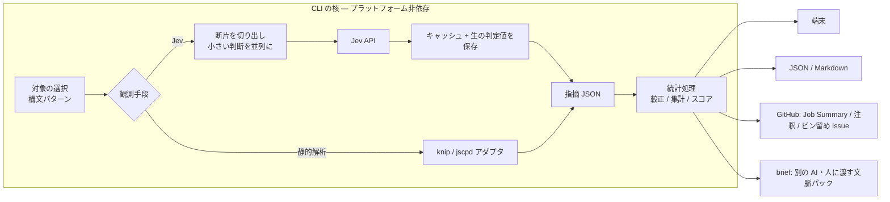

# jev-checkup (仮称) — アイデアメモ

> 状態: 構想段階。コードはまだ無い。
> 日付: 2026-09-20 (同日、レビューのフィードバックを反映して改訂)
> このメモは壁打ちの記録であり、**決定** と **提案** を区別して書く。提案は未合意。

## 一言で

> **静的に検査できない健康性を、検査可能にする。**

**リポジトリのソフトウェアエンジニアリング上の健康状態を、継続的に可視化する** CLI。
GitHub Actions から実行しやすいオプションを備える。

コードから判断可能な複数の観点を測定し、観点別スコア・総合スコア・トレンドと、
根拠となる優先度つきの指摘を、ひとつの**健康性ダッシュボード**として提供する。

意味を読む判断には [Jev](https://typesafe.ai) (TypeSafe AI の System One モデル) を、
**小さい文脈の小さい判断を大量に並列で回すセンサー**として使う。結果の合成・較正・集計はコード側の統計処理で行い、
静的解析ツールを併用する。深い読解は、別の AI・人・実行による検証に渡せる形で出す (決定 A)。

> この位置づけは**決定** (決定 D)。同日中に一度「指摘が主役、スコアは補助指標」と確定したが、
> それは単なる指摘ツールの定義であり、構想しているプロダクトとずれていたため、ダッシュボードとして置き直した。

## 背景 — なぜ作るか

発端は、あるリポジトリ (HardwareVisualizer) のフロントエンドを jev-lint で監査した一日の出来事。

- 140件の指摘を全件コードと突き合わせたところ、**テスト名が主張する振る舞いを本体が検証していないテストが13件**見つかった。
- そのうち1件は**本番の実バグを隠していた**。`omits linkLocalIpv6 section when array is empty` というテストは
  「省略」を一度もアサートしておらず、実装は `[]` が truthy なため常にその行を出力していた。
- `git blame` で起源を辿ると、13件中10件が**カバレッジを上げる目的で追加されたテスト**だった。
- カバレッジレポートは、そのテストが狙った分岐が未カバーのまま (= 到達不能) であることをずっと示していた。
  しかしゲートは全体 60% の閾値だけで、誰にも伝わらなかった。

ここから得た原則 (メンテナの言葉):

> カバレッジ目的のテスト追加をせず、何を守りたいかを言語化できるテストが重要

同種の「良いとされる判断」は他にもある。

- 守りたいものが明確でないテストを足さない
- YAGNI — 今の要件が必要としないものを作らない
- 過剰な設計をしない
- ソースコードを見ればわかることをドキュメントやコメントに書かない
- DRY

これらは多くのプロジェクトでガイドラインに**文章としては既に書かれている**。
足りないのは観点の定義ではなく、それが守られているかを継続的に確かめる**チェッカー**である。

## 決定事項

| # | 決定 |
| --- | --- |
| 1 | **利用者と用途**: リポジトリのメンテナが、コードベースの健康性を定期的に確認する。合わせて CI で PR の評価にも使える |
| 2 | **配布形態**: 他人も使える公開ツール。**本体は CLI** とし、その上で GitHub Actions で実行しやすいオプションを整備する |
| 3 | **対象範囲**: コードだけで裁ける観点に限る (要件や PR 本文を読まないと裁けないものは対象外) |
| A | **判定の構成**: Jev は「小さい文脈の小さい判断を大量に並列で回すセンサー」として使う (Jev API を直接呼ぶ)。全部を Jev に裁かせない。合成・較正・集計はコード側のアルゴリズムと統計で行い、深い読解は別の AI・人・実行による検証に渡す。jev-lint には依存しない。README に jev-lint から着想を得たことを明記する。**jev-lint のコードはコピーしない** |
| B | **スコア**: 観点ごとのスコアに加えて総合点も出す |
| C | **MVP の範囲**: 定期スキャン → JSON → スコア → Job Summary + ピン留め issue。観点は テスト / 名前 / 未使用 / 重複 の4つ。PR モードと再較正ループは次の版 |
| D | **プロダクトの中心**: コードベースの健康性ダッシュボード。総合スコア・観点別スコア・トレンド・根拠となる指摘 (信頼度、較正状態、優先度つき) を一体として「健康状態」を表現する。「読む価値のある問題を信頼度つきで届ける」はプロダクトの定義ではなく、ダッシュボードを有用で信用できるものにするための**設計原則** |
| — | リポジトリ名には `jev` を含める。このメモは日本語で書く |

## プロダクトの中心 (決定 D)

中心に置くのは、**リポジトリのソフトウェアエンジニアリング上の健康状態を継続的に可視化すること**。

```text
Codebase Health Dashboard
│
├─ Overall Health Score
│
├─ Dimension Scores
│  ├─ Test honesty
│  ├─ Naming honesty
│  ├─ Unused code
│  └─ Duplication
│
├─ Trends
│  └─ 前回・過去期間からの変化
│
└─ Findings
   ├─ 優先して読むべき問題
   ├─ confidence / calibration
   ├─ 根拠
   └─ 対応状況
```

| 階層 | 内容 |
| --- | --- |
| 主目的 | コードベースの健康性を可視化する |
| 手段 | 複数の観点を測定する |
| 信頼性を担保する仕組み | 較正 |
| 実際のアクションにつなげる仕組み | 優先順位つきの指摘 |

### 何が新しいか — 静的に検査できない健康性を検査可能にする

コードベースの健康性のうち、**構文や型やグラフから決まる部分**は、既存のツールが既に検査している
(リンタ、型検査、複雑度、未使用の検出、クローン検出)。

検査されてこなかったのは、**読んで意味を理解しないと判断できない部分**である。

- テストは、名前が主張するものを本当に守っているか
- 名前は、実装がしていることを正しく言っているか
- コメントは、まだ本当のことを言っているか

これらは今まで、レビューで人が読むことでしか確かめられず、継続的にも定量的にも追えなかった。
発端の監査で見つかった実バグは、カバレッジもリンタも型検査も通過していた。

「検査可能にする」とは、次の3つを揃えることを指す。ダッシュボードの構成要素は、それぞれここに対応する。

| 検査可能であるための条件 | 担う仕組み | ダッシュボード上の姿 |
| --- | --- | --- |
| 観測できる | 意味を読める判定手段 (Jev) に、コードが示せる範囲の問いを訊く | 観点別スコア、指摘 |
| どこまで信用できるかがわかる | 較正 | 信頼度、較正状態、「測れていないもの」の明示 |
| 時間を追って比べられる | 測定条件の記録と履歴 | トレンド |

### 設計原則: 読む価値のある問題を届ける

「読む価値のある問題を、信頼度と機械可読な根拠つきで継続的に届ける」は、プロダクトそのものの定義ではない。
健康性ダッシュボードを**有用かつ信用できるものにするための設計原則**として扱う。
指摘の一覧の質は Precision@N で測る (後述)。

### 文書全体で維持する思想

- 数字だけを出さず、必ず根拠へ辿れる
- スコアを上げること自体を目的にしない
- 非決定的な判定は較正状態を表示する
- 測れていないものを「正常」と扱わない
- PR の品質ゲートより、継続的な健康診断を主用途にする
- 指摘は網羅性だけでなく、読む価値の高さを重視する
- 総合点、観点別スコア、トレンド、指摘を一体として「健康状態」を表現する

## 実装前に最優先で固めること

レビューの指摘。実装より先に、次の4点を決める。

1. 何を正解ラベルとするか
2. 正誤と優先度をどう分けるか
3. 何を「測れていない」と明示するか
4. 上位 N 件の有用性をどう評価するか

以下の「ラベルと指標」「スコアの意味」「最初の一手」がそれにあたる。

## ラベルと指標 (提案・レビュー反映)

### 正誤・優先度・対応状況は別の情報

```text
validity:   valid / invalid / unknown
priority:   high / medium / low
resolution: fix / accept / defer / dismiss
```

較正と指摘の並べ替えは、別の目的である。

| ラベル | 用途 |
| --- | --- |
| 正誤 (`validity`) | 判定確率の較正 |
| 優先度 (`priority`) | 指摘のランキング |
| 対応状況 (`resolution`) | ダッシュボード上の対応状況の表示 |

- **較正に使うのは正誤。** コードという審判がいるので、比較的客観的に付けられる。
- **抑制コメントを `clean` (= invalid) として学習させない。** 「正しいが直さない」指摘を誤りだと教えることになる。
  監査では、事実として正しい 49件のうち直すべきは 13件で、残り 36件は「正しいが軽微」だった。
- **並べ替えに使うのは優先度。** 正誤だけで最適化すると、事実として正しいが軽微な指摘でダッシュボードが埋まる。
  だから両方の情報を保存する。
- 監査の判定をこの形に写すと: 直すべき 13件 = `valid` + `high` / `fix`、正しいが軽微 36件 = `valid` + `low`、誤り 91件 = `invalid`。

### 指標

| 指標 | 意味 | 用途 |
| --- | --- | --- |
| 指摘が正しい確率 | 確信度の帯ごとの `valid` の割合 | 較正、信頼度の表示 |
| 優先度の分布 | `valid` のうち `high` とされた割合 | 並べ替え |
| **Precision@N** (指摘一覧の主要指標) | 上位 N 件のうち、実際に読む価値・対応価値があった件数 / N | 指摘一覧の質の判断 |
| 見落とし率 | 指摘されなかったものをサンプリングして測る | 「測れていない範囲」の表示 |

### データの扱い

- **開発用と評価用を分ける。** 質問文や閾値を調整するのに使ったデータでの性能は過大評価になる。
- **分割はファイル単位。** 同じ fixture やヘルパーへの過適合を避けるため、テスト単位では分けない。
- **手元のラベルは偏っている。** ラベルが付いているのは jev-lint が指摘したものだけで、指摘されなかったテストの正誤は誰も見ていない。
  見落とし率は測れず、自前ルールの指摘集合は別物になるので適合率の推定も偏る。無作為サンプルへのラベル付けが要る。
- **量が足りない。** 直すべきは 13件。ファイル単位で分けると評価側に 4〜5件しか残らない。別ディレクトリや別リポジトリでラベルを増やす。
- **対になったデータが既にある。** 監査で直した 13件は「修正前 / 修正後」の対で、修正後の 12件はミューテーションで検証済み。
  同じテストの前後で判定値が下がるかは、正解が最も確かな検証になる。

なお監査時に「67件 (直すべき 13 / 誤検知 54)」と数えたのは、正誤と優先度を混同した切り方だった。
テストの観点の開発用データは正しくは **86件 = valid 32 / invalid 54、うち fix 13**。

## 何を測るか

「コードだけで裁ける」に絞ると、観点は2つの問いに整理できる。

| 問い | 意味 |
| --- | --- |
| **正直さ** | コードは自分について本当のことを言っているか (名前、コメント、テスト名が、実際の中身と一致しているか) |
| **必要性** | 入っているものは全部必要か (未使用、重複、言い換えにすぎないコメント) |

### 観点と観測手段

観点ごとに、何で観測できるかが違う。どの手段も**絶対的な審判ではない**。

| 観点 | 問い | 観測手段 | 出てくるもの | MVP |
| --- | --- | --- | --- | --- |
| テストが名前どおり守っているか | 正直さ | Jev | モデルの推定 (確率) | ○ |
| 名前と実装の一致 (関数・変数・モジュール) | 正直さ | Jev | モデルの推定 (確率) | ○ |
| 未使用の export・ファイル・依存 | 必要性 | 静的解析 (knip 等) | **未使用候補** | ○ |
| 重複 | 必要性 | クローン検出 (jscpd 等) | **重複候補** | ○ |
| コメントの真偽 | 正直さ | Jev | モデルの推定 | 後 |
| コードの言い換えにすぎないコメント | 必要性 | Jev (要測定) | モデルの推定 | 後 |
| 失敗を隠す `catch`、ログレベルの不一致 | 正直さ | Jev | モデルの推定 | 後 |
| テストが何かを守っているか | 正直さ | ミューテーションテスト | **生き残ったミュータント** | 後 |
| 単一実装の抽象、常に同じ値が渡る引数 | 必要性 | 実験枠 | — | 後 |

### 観測事実と評価を分ける

「決定的」は「再現可能」であって「正しい」ではない。

- **knip** は設定や動的参照しだいで誤検知する。
- **jscpd** が見つけるのは重複であって、「共通化すべき」かどうかは別の判断 (誤った共通化は DRY の典型的な失敗)。
- **ミューテーションテスト**で生き残ったミュータントが、必ずテスト不足を意味するわけではない。
  監査で見つけた「消しても結果が変わらないガード」は等価ミュータントの実例。

したがって **観測した事実の名前**で報告し、設計判断と混ぜない。

- 「DRY 違反」ではなく「重複候補」
- 「未使用である」ではなく「参照グラフ上で未使用」

レポートでは、モデルが推定したことと、静的解析や実行で確認できた事実を区別して見せる。

### 対象外

- **要件を読まないと裁けない YAGNI・過剰設計。** コードに痕跡が残る部分 (未使用、単一実装の抽象) だけを必要性の観点として扱う。
- **数えれば決まるもの** (複雑度、関数長、ネスト)。既存の静的解析ツールの領分。
- **スタイル。**

### Jev に訊いてよいこと・いけないこと

- リンタや型検査で決まることをモデルに訊かない。
- 見せたコードに答えが含まれていないことを訊かない。症状は「全回答が中間値に寄る」で、閾値の問題に見えるが実際は文脈の問題。
- 1つの対象は重複相手を見られない。だから重複の**候補を見つける**のは Jev ではなくクローン検出の仕事。
  候補の対を並べて見せれば、「同じ概念か、偶然似ているだけか」の小さい判断は Jev にも訊ける (後の版)。
- 文脈は、その質問に答えるのに要る最小限にする。無関係な内容が増えると精度が落ちる (公式ドキュメント)。
- 総合判断、説明文、数えること、多段の推論を Jev に任せない。Jev が返すのは小さい判断の確率で、
  それをどう読むかはコード側の統計処理が決める。深い読解が要るものは別の AI か人に渡す。

## 根拠の示し方 (提案・レビュー反映)

Jev が返すのは確率や選択結果で、自由記述の説明ではない。**理由を捏造しない。** レポートに出す根拠は次のもの。

- 対象の位置
- 訊いた質問
- 判定値 (閾値を適用する前の生の値)
- 該当コード
- そのルールが何を見ているかの説明 (人が書いた固定の文章)

**理由は原子的な質問として持つ。** 1つの観点を複数の原子的な質問に分解し、結果をコード側で合成する。

```text
- 存在・型・長さしか検証していないか
- テスト名が主張するケースをセットアップしているか
- アサーションが対象の振る舞いと無関係に成立しないか
```

どの質問が立ったかが、そのまま機械可読な理由になる。

```text
test-behavior: suspicious

reasons:
  setup_matches_claim: false
  assertion_checks_behavior: false
  assertion_can_pass_independently: true
```

- モデルに説明文を書かせないので、理由を捏造しない。
- **原子的な質問ごとに較正できる。** 判定根拠そのものが検証可能になる。
- 合成の重みはコード側に置く (モデルに総合判断を任せない)。
- **極性に注意。** 上の例は「false が問題」の質問と「true が問題」の質問が混ざっている。
  合成を単純にするには「真 = 問題」に揃えるか、質問ごとに極性を持たせる。
- 費用への影響は小さい。同じ断片 (`state`) への質問は1リクエストに載せられ、`state` は1回しか課金されない。

Jev の公式ドキュメントにある、1リクエストに複数の質問を載せるパターンと、原子的なスコアを組み合わせるパターンに沿う。

## スコア

**決定**: 観点ごとのスコア + 総合点。

### スコアの意味を限定する (レビュー反映)

```text
1 − (指摘された対象 / 評価した対象)
```

スコアは「絶対的なコード品質」ではなく、**観測可能な複数の健康指標を要約した値**として扱う。
観点スコアの素になるこの率は、観測された問題密度である。

100点を目指す品質ゲートではなく、**健康診断の数値として、悪化や異常を発見するために使う**。

**率だけでは壊れる。** 正常な対象を増やせば、問題を1つも直さなくてもスコアは上がる (分母の水増し)。
だからスコアには必ず次を添え、トレンドの主役は率ではなく**同じ測定条件での「新規 / 解消」の件数**にする。

- 観点別スコア
- 未解決の指摘数
- 評価した対象の数
- 判定不能だった数 / 総合点に含まれた観点の数
- 較正状態
- 測定条件
- 過去からのトレンド

スコア単体では見せない。総合点、観点別スコア、トレンド、指摘を一体として健康状態を表現する。

**比較できないものは比較しない。** モデル・質問文・対象の選び方・文脈の組み立て方・較正条件のどれかが変わったら、
前回比を出さず、基準線をリセットしたと表示する。これらをまとめたハッシュを「測定条件の版」として各実行に記録する。

### 既知のリスク

スコアは目標になった瞬間に壊れうる (カバレッジ % がまさにそうだった)。観点同士も衝突する (重複を減らす圧力と、抽象を減らす圧力)。
総合点を出すと決めた以上、上げにいかれても壊れにくい設計を最初から組み込む。

### 設計方針 (提案)

- **スコアは指摘の要約にする。** 減点1つごとに場所つきの根拠が紐づく。
- **正しい確率で割り引く。** 指摘を同じ重みで数えず、確信度の帯ごとの `valid` の割合で期待値にする。
- **較正状態を併記する。** `calibrated on N labels` / `uncalibrated`。
- **未較正の観点は表示するが総合点に入れない。**
- **総合点 = 観点スコアの加重平均。** 重みは設定ファイルに置き、レポートに必ず表示する。既定は等重み。
- **ノイズ未満の差分は出さない。**
- **PR では差分を出す。** 絶対値は既定ブランチのトレンドとして見せる。
- **必須チェックにしない。** 既定では終了コードでビルドを落とさない。

## 較正 — このツールの芯 (提案)

同梱ルールをそのまま使った実測では、テストの観点の誤検知は 63% だった。
有用になったのは、全件を手で判定して「どの確信度帯なら信用できるか」がわかった後である。

価値の源泉はルールそのものより、**そのリポジトリ上でどこまで信用できるかがわかること**にある。

- 公開ツールは利用者のリポジトリでの精度を知らないので、既定はツール自身のコーパスから得た事前値。
- 利用者が指摘に **正誤** と **対応方針** を付けられるようにし、正誤のほうを較正に回す。
- 「一見怪しいが実は正しい」ケースが較正には最も効く。自明にきれいな例だけで合わせた閾値は、最初の未知コードで外れる。

## 定期スキャンの意味 (レビュー反映)

同じコード・モデル・質問・文脈の判定はキャッシュされるので、**再実行するだけでは新しい問題は見つからない。**

ただし定期スキャンには、PR モードでは代替できない役割がある。

```text
fork からの PR
  ↓
シークレットが渡らず Jev の評価を skip
  ↓
既定ブランチへ merge
  ↓
定期スキャンで初めて評価される
```

定期スキャンの役割は次のとおり。

- **変更された既定ブランチの継続監査**
- **fork PR 経由で未評価だったコードの後追い評価**
- **ルール・モデル・文脈を変更したときの再評価**
- 静的解析側の変化の検出 (消費側が消えて未使用になった export など、変更されていないファイルにも起こる)

既存コードから新しい問題を見つけるには、ルールの更新・モデルの更新・文脈の改善・明示的な再評価のいずれかが要る。
(監査中に同じファイルから問題が次々出てきたのは、人とエージェントが精読とミューテーションで掘った結果であって、
同じスキャンの再実行で出たものではない。)

## カスタマイズ (提案)

観点は設定として定義できるようにする。

| 要素 | 内容 |
| --- | --- |
| 対象の選び方 | 構文パターン (どのコードを見るか)。広めに拾い、判断は観測手段に任せる |
| 観測手段 | `jev` / 静的解析ツールのアダプタ |
| 質問文と判定基準 | Jev に訊く1文と、真・偽がコード上でどう見えるかの説明 |
| 文脈 | 何を一緒に見せるか。観点ごとに、答えるのに要る最小の断片 ([DESIGN.md](DESIGN.md) の「断片」) |
| 閾値 | 指摘として扱う確率。質問文には数字を書かない |
| 重み | 総合点への寄与 |
| ラベル | その観点の較正データ |

設定スキーマは自分たちで設計する (jev-lint のルール形式を写さない)。

## アーキテクチャ (提案)

**CLI が本体**で、判定の核はプラットフォームに依存しない。GitHub 固有の処理はレポータとして外側に置く。

> 構成の詳細は [DESIGN.md](DESIGN.md) にある。食い違う場合は DESIGN.md のほうが新しい。



### CLI と GitHub Actions 向けのオプション

- 手元で push 前に回せる。GitHub 以外の CI でも使える。Action は CLI を呼ぶ薄い層。
- **送信前に計画と費用を出す。** `--dry-run` で対象数・リクエスト数・概算費用を表示し、何も送らない。お金がかかるツールなので必須。
- **費用の上限。** 見積もりが予算を超えたら実行しない。大きなリポジトリでの初回実行の事故を防ぐ。
- 出力形式の切り替え (端末 / JSON / Markdown / GitHub)。`GITHUB_STEP_SUMMARY` があれば Job Summary に書く。
- 差分モード (基準の ref を指定)。
- キャッシュの場所の指定 (`actions/cache` と組み合わせる)。
- 終了コードの方針を選べる。既定は落とさない。
- API キーは環境変数からのみ読む。設定ファイルには書かせない。

### Jev API

公開ドキュメントだけで実装できることを確認済み。

- `POST https://api.typesafe.ai/v1/systemone`、`Authorization: Bearer <key>`
- リクエストは `state` (文脈) + `model` + `questions` (複数可)。ファイルは1回送れば済む
- プリミティブ: Noul (真偽の確率 0–1) / Score (段階評価 + confidence) / Choice
- 応答に実モデル版 (例 `jev-1.13.0`) が返る
- 公式の JavaScript SDK と Python SDK がある

### バッチ内の対象指定 (レビュー反映)

質問の ID やキーはモデルには意味を持たない。ファイル全体を `state` に渡して複数のテストについて訊くとき、
「このテストについて」だけでは対象が定まらない。
**各質問の中に、対象のテスト名と位置 (必要なら対象コードの識別情報) を明示する。**
対象を取り違えていないかはスパイクで測る。

断片に対象が1つしか無ければ、取り違えは起きない。DESIGN.md の構成 (1 対象 = 1 断片 = 1 リクエスト) では、この問題自体が消える。

### キャッシュ (レビュー反映)

ファイル全体を渡すなら、テスト本体が変わっていなくても `beforeEach` の変更で判定は変わる。キーは文脈全体を含める。

```text
hash( モデル + state 全体 + 質問 + 文脈の組み立て方の版 )
```

- `jev-latest` を指定しても、判定ごとに**解決された実モデル版**を保存する。版が変わったら再評価が必要な状態として扱う。
- **閾値を適用した後の結果だけでなく、生の判定値と測定条件を MVP から保存する。**
  較正方法を変えても過去のデータを再利用でき、閾値を変えるたびに訊き直さずに済む。
- キーの単位は「断片 × 質問」。テスト1件を編集して無効になるのは、そのテストの断片だけ (共有のセットアップを変えれば、それを含む断片すべて)。ファイル全体を渡す方式より命中率が高い。
- `actions/cache` に置けば fork PR からは書き換えられない (キャッシュを編集できる者は指摘を消せるので、信頼境界として扱う)。

### ダッシュボードの出力先

Job Summary と、実行のたびに上書き更新するピン留め issue (Renovate の Dependency Dashboard 方式)。インフラ不要。
構成は「プロダクトの中心」の図のとおり: 総合スコア → 観点別スコア → トレンド → 指摘。

### トレンドと履歴 (提案)

トレンドはダッシュボードの構成要素なので、**実行結果の履歴を持つことが MVP の要件になる**
(ピン留め issue は最新の状態しか持てない)。

- 各実行の結果 (スコア、件数、生の判定値、測定条件の版) を JSON として残す。
- 置き場所の候補: 専用ブランチに積む / Actions の成果物 / `actions/cache`。
  成果物は保持期間があり、キャッシュは消えうる。長期のトレンドを見せるなら専用ブランチが素直。
- トレンドは**同じ測定条件の実行どうし**でしか引かない。条件が変わった時点で線を切り、基準線のリセットとして示す。
- 主役は率の推移より「新規 / 解消」の件数 (率は分母の水増しで動くため)。

### 費用の目安 (実測)

料金は入力 10億トークンあたり $42。

| 対象 | 対象数 | 入力トークン | 概算 |
| --- | ---: | ---: | ---: |
| フロントエンド全体 (`src/`) | 8,718 | ~6.8M | $0.29 |
| リポジトリ全体 (Rust 込み) | 22,787 | ~17.2M | $0.72 |
| 直近2コミットの差分 | 139 | ~150K | $0.006 |

## jev-lint との関係

このツールは [jev-lint](https://github.com/mizchi/jev-lint) (mizchi 氏、MIT) から着想を得ている。README にその旨を明記する。
一方で実装は独立させ、**コードはコピーしない**。

| | 扱い |
| --- | --- |
| 着想 (構文マッチで対象を選ぶ、1文で訊く、ルールごとの閾値、内容ハッシュのキャッシュ、ラベルによる較正) | アイデアとして使い、出典を明記する |
| ソースコード | 写さない。このプロジェクトのために jev-lint の実装は読まない |
| ルールの質問文・判定基準 | コードと同じ扱い。自分たちの言葉で書き、自分たちのラベルで較正する |
| 監査で得た判定 | 自分たちのコードに対する自分たちの判断。較正データとして使う |
| jev-lint 本体 | 開発中のブラックボックスの比較対象としてのみ使う |

進め方は clean-room 型にする: 自分たちの言葉の仕様書を書き、実装は仕様書と公開 API ドキュメントだけを見て行う。

## 公開ツールとしての制約

- **ソースコードが手元やランナーの外 (typesafe.ai) に出る。** private リポジトリの利用者には最重要の情報。README の最上部に書く。
- **「学習に使わない」と「保存しない」は別。** TypeSafe 側のデータの扱いを、この2点を分けて確認する。
- **API キーは利用者持ち (BYOK)。**
- **brief を別の AI に渡すと、コードの送信先が増える。** ツール自身は送らない。書き出すだけで、渡す先は利用者が決める。
- **fork PR にはシークレットが渡らない。** PR モードは fork では評価を skip し、その旨をログと README に明示する (失敗扱いにはしない)。
- **対応言語を宣言する。** まず TypeScript / JavaScript。テストベッドの都合で Rust も候補。
- **モデル版を固定できるようにする。**
- **依存の若さ。** API や料金が変わる前提で、判定バックエンドとの境界を薄く保つ。

## MVP

**決定済みの範囲**

- 定期スキャン → 指摘 JSON → スコア → Job Summary + ピン留め issue
- 観点4つ: テスト / 名前 (Jev)、未使用 / 重複 (静的解析)
- テストベッドは HardwareVisualizer

**決定 D から導かれる追加 (提案)**

- ダッシュボードの4要素 (総合スコア / 観点別スコア / トレンド / 指摘) を最初の版から揃える
- そのために実行結果の履歴を持つ (上の「トレンドと履歴」)
- 指摘には優先度と対応状況を持たせる。MVP では、ラベルの入力手段は最小限でよい (例: リポジトリ内のラベルファイル)

**エンジンの切り方 (提案)**

- 入れる: CLI、対象選択 (ast-grep を依存として利用)、観点ごとの小さい断片、制限内で並列に流す実行、断片 × 質問をキーにしたキャッシュ、
  生の判定値の保存、`--dry-run` と費用の上限、ラベルとの結合による較正とスコアリング、実行結果の履歴、ダッシュボードのレポータ、
  別の AI・人に渡す brief、knip / jscpd アダプタ
- 後回し: 較正ツール一式、PR モード、ラベル付けから再較正へのループ、ミューテーションテストのアダプタ

文脈の決め方には、相反する2つの事実がある。実測した誤検知の主因は「テスト本体しか見せなかったこと」だった
(前提が `beforeEach`・fixture・ヘルパー・定数・隣のテストにあるケースが見えなかった)。
一方で Jev は、判断に無関係な内容が増えると精度が落ちる (公式ドキュメント)。
両方に応えるため、テストの断片は「兄弟テストを除いたファイル」とする (ファイル内の前提は全部残り、かさの大半を占める他のテストだけが消える)。
スパイクで3条件を比べて確定する。

## 最初の一手 — 作る前のスパイク (提案・レビュー反映)

単純な「分離できるか」では評価しない。

### 最優先

1. **直した 13件の修正前 / 修正後を比較する。**
   - 修正前で問題の確率が高いか
   - 修正後に判定値が下がるか

   同じテストの前後を比べるので、別々のテスト同士を比べるより条件差が小さい。
   修正後の 12件はミューテーションで検証済みで、手元で最も正解が確かなデータ。
2. **断片の3条件を比較する。** テスト本体のみ / 兄弟テストを除いたファイル / ファイル全体。
   文脈を足すと本当に誤検知が減るか、足しすぎると精度が落ちるか。
3. **指摘されなかったテストを無作為にサンプリングして人が確認する。**
   - jev-lint が見逃した問題がどの程度あるか
   - 自作ルールを評価するための母集団を作る

### その次

4. ファイル単位で開発用・評価用に分ける
5. 上位 N 件を読んだときの有用率を見る
6. 同じコードに対する複数回の実行で、判定値の揺れを測る

加えて、バッチ内で対象を取り違えていないかを確かめる (同じファイルの別のテストについて訊いて、判定値が対象に追従するか)。

### 評価指標と撤退条件

単純な accuracy ではなく、次を重視する。

```text
Precision@N = 上位 N 件のうち、メンテナが有用と判断した件数 / N
```

撤退条件は完全な分離ではなく、次のどちらかを満たせるかに置く。

> 同じレビュー量で、より多くの有用な問題を発見できるか

> 同じ数の有用な問題を、より少ないノイズで発見できるか

比較対象は、無作為に選んだテストを同じ件数読む場合と、jev-lint (ブラックボックス) の上位を同じ件数読む場合。
費用は数セント、使い捨てスクリプトで足りる。

## 根拠データ — 監査の実測 (2026-09-20)

対象は HardwareVisualizer の `src/`、8,718 対象、指摘 140件。全件を実コードと突き合わせて判定した。

| 判定 | 件数 |
| --- | ---: |
| 事実として正しい (valid) | 49 |
| 　うち直すべき (fix) | 13 |
| 　うち正しいが軽微 | 36 |
| 誤り (invalid) | 91 |

**確信度の帯ごとの内訳** (閾値からの余裕)

| 余裕 | 件数 | valid | うち fix | invalid |
| --- | ---: | ---: | ---: | ---: |
| ≥ +0.30 | 20 | 16 (80%) | 11 | 4 |
| +0.15〜0.30 | 39 | 13 (33%) | 2 | 26 |
| +0.05〜0.15 | 36 | 12 (33%) | 0 | 24 |
| < +0.05 | 45 | 8 (18%) | 0 | 37 |

**わかったこと**

- 直すべき 13件のうち 10件は、カバレッジ目的で追加されたテストに由来していた。
- テストの観点の誤検知は構造的だった。モデルにテスト本体しか見せておらず、`beforeEach`・fixture・ヘルパー関数・本番コードの定数・隣のテストにある前提が見えていなかった。
- 「テスト対象のモック」を問う観点は誤検知 90%。IPC や i18n のような**境界のモック**を取り違えていた。
- Jev が1件も見つけなかったものを、ミューテーション (本番コードを壊してテストが赤くなるか) が3件見つけた:
  未使用の状態、消しても結果が変わらない死んだ分岐、import されていないモジュールへの無効なモック。
  ミューテーションは実行で確かめられる強い証拠だが、等価ミュータントがあるので絶対ではない。Jev はその安い予測という位置づけになる。

## 未決事項

- リポジトリ名 (`jev-checkup` は仮称)。製品名に `jev` を含めてよいかを **TypeSafe に確認する**
- ライセンス
- 実装言語とランタイム (公式 JS SDK があるので TypeScript が自然)、Action の形式
- カスタム観点の設定スキーマ、ラベル (正誤 / 優先度 / 対応状況) を利用者がどこでどう付けるか
- Jev の利用規約とデータの取り扱い — 学習への利用と保存を分けて確認する
- 総合点の既定の重みと、未較正の観点が多いリポジトリでの総合点の見せ方
- **静的に検査できる観点 (未使用・重複) を最初の版に入れるか。** 決定 C では4観点に含めたが、
  「静的に検査できない健康性を検査可能にする」という命題に照らすと、独自の価値は Jev で見る観点の側にある。
  健康状態の全体像としては入っていたほうが自然、という見方もある
- 履歴の置き場所 (専用ブランチ / 成果物 / キャッシュ)。トレンドが中心要素になったので、後回しにできない
- ダッシュボードを将来 Job Summary と issue 以外 (静的ページなど) にも出すか
- 対象の選択に ast-grep を使うか、TypeScript コンパイラ API にするか (後者は TS/JS 限定になる)
- ラベルをどこから増やすか (別ディレクトリ、別リポジトリ、無作為サンプル)
- 精読した AI が付けたラベルの扱い。提案: ラベルに出所 (人 / AI / 実行) を持たせ、較正の評価には人と実行のものだけを使う ([DESIGN.md](DESIGN.md) の「ラベル」)

## 参考

- Jev / TypeSafe AI: <https://typesafe.ai> / ドキュメント <https://docs.typesafe.ai> (索引は `/llms.txt`)
- jev-lint (着想元): <https://github.com/mizchi/jev-lint>

## 改訂履歴

- 2026-09-20 初版
- 2026-09-20 レビューのフィードバックを反映: ラベルを正誤と対応方針に分離、スコアを「観測された問題密度」に限定、
  静的解析も絶対的な審判としない、根拠の示し方、バッチ内の対象指定、キャッシュキー、定期スキャンの意味、スパイクの評価項目と撤退条件。
  配布形態を「CLI が本体、GitHub Actions 向けオプションを整備」に更新
- 2026-09-20 レビュー (更新版) を反映: 率は分母の水増しで上がるためトレンドの主役を「新規 / 解消」の件数に、
  総合点を補助指標として位置づけ、理由を原子的な質問として持つ (出力例・極性の注意)、生の判定値に加えて測定条件も保存、
  定期スキャンの3つの役割、スパイクの優先順位と Precision@N、撤退条件の2つ目、fork PR の skip を明示
- 2026-09-20 ツールの核の再定義を決定 D として確定 (指摘が主役、スコアは補助指標)
- 2026-09-20 決定 D を置き直し: プロダクトの中心は健康性ダッシュボード (総合スコア / 観点別スコア / トレンド / 指摘を一体として健康状態を表現)。
  「読む価値のある問題を届ける」は設計原則に。スコアは「観測可能な複数の健康指標を要約した値」、用途は健康診断 (悪化や異常の発見) でゲートではない。
  ラベルを 正誤 / 優先度 / 対応状況 の3つに。トレンドのために履歴の保持を MVP の要件に追加 (提案)
- 2026-09-20 プロダクトの命題「静的に検査できない健康性を、検査可能にする」を追加。検査可能の3条件 (観測できる / 信用の度合いがわかる / 時間を追って比べられる) とダッシュボードの要素を対応づけ
- 2026-09-20 決定 A を改訂: Jev を「判定エンジン」から「小さい判断を大量に並列で回すセンサー」へ。合成・較正・集計はコード側の統計処理、
  深い読解は別の AI・人・実行に渡す (brief)。文脈を「ファイル全体に固定」から「観点ごとの小さい断片」へ (スパイクで確定)。
  重複の対判断、ラベルの出所を追記。構成の詳細は DESIGN.md に移した
